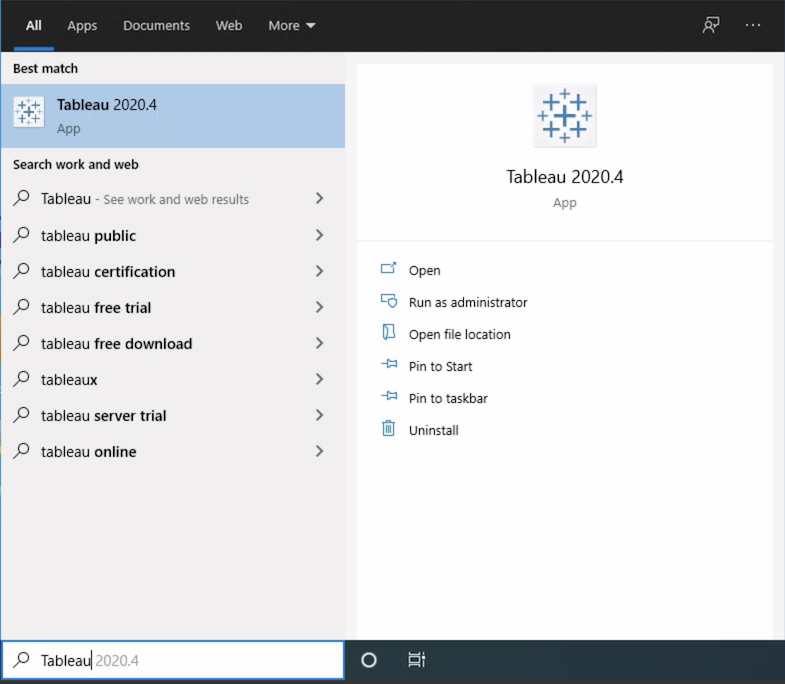
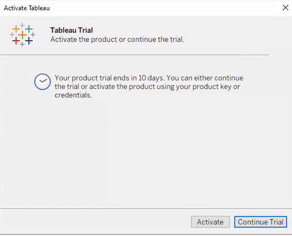

## Part 1 - Getting Setup with Tableau on your Windows Virtual Desktop

Students in this course will be able to use a Windows Virtual Desktop to launch Tableau. 

## Connecting to your Virtual Desktop

In order to connect to your virtual desktop you will need to go to [http://VirtualDesktop.ku.edu](http://VirtualDesktop.ku.edu).

If you are not signed into the KU network you will be presented with the page below to enter your student credentials.

<figure>
    
    <figcaption style="text-align:center;">Figure 1<figcaption>
</figure>

After logging in, you will be brought to the Remote Desktop Web Client. Click the icon that says **KU Virtual Lab Desktop**.

<figure>
    
    <figcaption style="text-align:center;">Figure 2<figcaption>
</figure>

If you are asked to *Allow local resources* select **Allow** to ensure your computer clipboard is functioning accurately.

<figure>
    
    <figcaption style="text-align:center;">Figure 3<figcaption>
</figure>

The WVD will attempt to establish a connection. Once a connection has been established you'll be presented with another *Credential Login* screen. Here it is recommended that you login with your KU ID email address with the domain **@home.ku.edu**.

<figure>
    
    <figcaption style="text-align:center;">Figure 4<figcaption>
</figure>

If you encounter an error with the connection, like the following figure, select **Reconnect** or refresh the page. 

<figure>
    
    <figcaption style="text-align:center;">Figure 5<figcaption>
</figure>

However, If you encounter an *error message* or a *black screen* that lasts longer than 5 minutes, contact the KU IT Customer Service Center at 785-864-8080 or itcsc@ku.edu with these details and any screenshots.

## File Storage and OneDrive

When saving files in your Windows Virtual Desktop it is recommended you utilize Microsoft OneDrive. When saving any file, navigate in the file explorer of the virtual desktop to the OneDrive folder.

<figure>
    
    <figcaption style="text-align:center;">Figure 6<figcaption>
</figure>

The files you save to OneDrive can be accessed on your Windows Virtual Desktop or from any computer at [https://onedrive.ku.edu](https://onedrive.ku.edu).

You should always save your files to the OneDrive location. If you save files anwhere else on the Windows Virtual Desktop there is no guarantee the file will continue to persist. 

## Launching Tableau

To lauch **Tableau** select the **Windows** button in the bottom left-hand corner and search for **Tableau**. This is the simplest way to launch the application. If the app does not appear try disconnecting from the virtual deskotp and reconnecting. If the app still does not appear let the professor know immediately.

<figure>
    
    <figcaption style="text-align:center;">Figure 7<figcaption>
</figure>

After launching the application, you will be presented with the **Welcome Screen**. This will present you with links to access data or recent sources, recent reports opened, & helpful links. You can close this for now. It will become more useful as you use Power BI more. 

<figure>
    
    <figcaption style="text-align:center;">Figure 8<figcaption>
</figure>

## Activating Tableau

Because **Tableau** requires a license we need to provide the class license key to activate the software for use during the semester. 

If a screen appears regarding a **Trial**, select the **Activate** button. 

<figure>
    
    <figcaption style="text-align:center;">Figure 9<figcaption>
</figure>

Once you are on the **Activation** screen do not enter any information to begin a new trial. Instead, select the **Activate Tableau** link. 

<figure>
    
    <figcaption style="text-align:center;">Figure 10<figcaption>
</figure>

The next screen will ask if you are going to activate with a **Product Key** or a **Server**. For our class we will select **Product Key**.  

<figure>
    
    <figcaption style="text-align:center;">Figure 11<figcaption>
</figure>

This is the screen where you will now provide your product key. The class key will be provided via email from the professor. Copy and paste the **Key** into the box showing `0000-0000-0000-0000-0000` and click **Activate**.   

<figure>
    
    <figcaption style="text-align:center;">Figure 12<figcaption>
</figure>  

Congratulations, you have activated Tableau on your virtual desktop to be used until the end of the semester. 

Sometimes when connecting to the virual desktop and launching Tableau a window appears saying `License Has Changed`. When this occurs click **Exit**. The application should relauch and follow the previous steps to reactivate with the classroom license.

<figure>
    
    <figcaption style="text-align:center;">Figure 12<figcaption>
</figure>

<!-- **[Part 2: Basic Introduction to Core Features](/Intro-to-Power-BI/?lab=part-2-basic-introduction-core-features)** -->