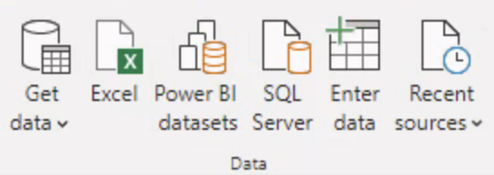
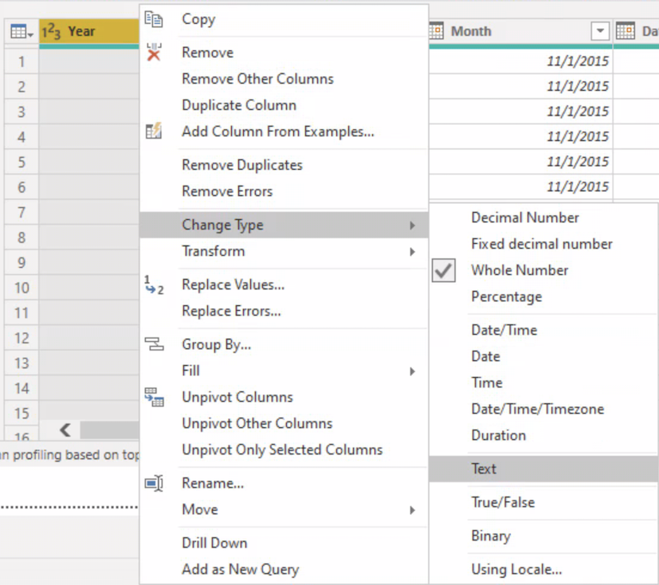
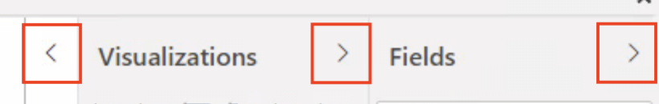

## Part 2 - Basic Introduction to Core Features

This section focuses on getting started with Power BI and introducing you to the interface.

With Power BI opened, a new blank report will be created unless a previously created Power BI report was opened. 

## Ribbon

Like all other Microsoft applications you will notice a **Tool Ribbon**, Figure 1 below, is included at the top of the screen. This will provide many useful functions and can be hidden by selecting the **Up Arrow**, Figure 2 below, in the bottom righ-hand corner of the ribbon.

<figure>
    
    <figcaption style="text-align:center;">Figure 1<figcaption>
</figure>

<figure>
    
    <figcaption style="text-align:center;">Figure 2<figcaption>
</figure>

## Connect to Data

Every report requires a data source. As an employee of KoolKart, an e-Commerce company that sells 4 categories of products, you can import and connect to datasets to look for innovative ways to increase revenues. You have been provided with a spreadsheet with thousands of rows of information and are struggling to make heads or tails of what you are evaluating. Let’s import the **[KoolKart Sales Data.xlsx](https://bradyjrothrock.github.io/Oracle-Analytics-Cloud-Workshop/Exercise%20Files/KoolKart%20Sales%20Data.xlsx)** file to see what insights we can glean. This can be done through the **Data** section of the **Home** ribbon.

<figure>
    
    <figcaption style="text-align:center;">Figure 3<figcaption>
</figure>

You will notice there are icons for standards Microsoft data sources. Additionally, under the **Get data** icon you will see the long list of acceptable files types and a the option **More** to access dozens of different data sources.

<figure>
    
    <figcaption style="text-align:center;">Figure 4<figcaption>
</figure>

<figure>
    
    <figcaption style="text-align:center;">Figure 5<figcaption>
</figure>

Select **Excel** and navigate to the **[KoolKart Sales Data.xlsx](https://bradyjrothrock.github.io/Oracle-Analytics-Cloud-Workshop/Exercise%20Files/KoolKart%20Sales%20Data.xlsx)** file.

<figure>
    
    <figcaption style="text-align:center;">Figure 6<figcaption>
</figure>

Select **Sheet1** to preview the data. At this point we can **Load** the table or **Transform Data** to make changres to the file before loading. 

<figure>
    
    <figcaption style="text-align:center;">Figure 7<figcaption>
</figure>

Select **Transform Data** and you will be brought to the **Power Query Editor**. Here you can wrangle your data and peform necessary transformations. You can see each of the steps applied in the **Query Settings** pane on the right. 

<figure>
    
    <figcaption style="text-align:center;">Figure 8<figcaption>
</figure>

We can now shape our data. To do this we provide our Power Query Editor with rules for adjusting the data while loading and presenting it. This doesn't affect the original data source, only this project's view of the data.

The system by default will determine the columns datatypes.

> **Text**: Indicated by **ABC**, and are generally non-numeric fields.

> **Whole Number**: Indicated by **123**, and are generally numeric fields.

> **Decimal Number**: Indicated by **1.2**, and are numeric fields with decimal values.

> **Datetime**: Fields may also be indicated by a **Calendar** icon. These will be your date and time based fields, which can be handled differently in certain visualizations.

Unlike Oracle Analytics Cloud (OAC), Power BI read our **Year** field in as a **Whole Number** instead of **Text** as it was defined in the Excel file. 

To change this we can right-click on a field name, locate the **Change Type** menue and select which of the many type options we would like. Let's update the type to be **Text**.

<figure>
    
    <figcaption style="text-align:center;">Figure 9<figcaption>
</figure>

You'll note that a box will pop-up asking if we would like to **Replace current** or to **Add new step**. This happens because Power BI already performed a transformation on the **Year** field converting it from **Text** to **Whole Number**. During the import step Power BI reads all fields in as **Text** and then selects a transformation based on the data structure.

<figure>
    
    <figcaption style="text-align:center;">Figure 10<figcaption>
</figure>

Select **Add new step** and see that we see a new step called **Changed Type1**. 

<figure>
    
    <figcaption style="text-align:center;">Figure 11<figcaption>
</figure>

If we instead selected **Replace current** it would update **Changed Type**. 

<figure>
    
    <figcaption style="text-align:center;">Figure 12<figcaption>
</figure>

There are two ways we can determine what all column types Power BI selected. You can visually inspect each and every field, or you can select **Advanced Editor** from the **Query** section of the ribbon.

<figure>
    
    <figcaption style="text-align:center;">Figure 13<figcaption>
</figure>

After selected **Advanced Editor** we're presented with the **Power Query** that is being developed. This is similar to the **Preparation Script** in Oracle Analytics Cloud. Select **Display Options** and **Word Wrap** to make all of the code visible on the screen. You can now see in the code for **#"Changed Type"** the function **TransformColumnTypes()** and each of the column type selections. You can also edit the Power Query code but this is not recommended. 

<figure>
    
    <figcaption style="text-align:center;">Figure 14<figcaption>
</figure>

Now delete **Changed Type1** by clicking the **X** next to the step. Instead we will transform the field and update the current step. We will also at this time transform Quarter & Month back to **Text**. It is important that we do all of these transformations with **Replace current** to ensure we get the exact text string that was imported. If we choose to **Add a step** all of the new changes will be applied within this new step and will converted the transformed date values to string instead of the original values.

<figure>
    
    <figcaption style="text-align:center;">Figure 15<figcaption>
</figure>

Once we've completed all the transformations needed, select **Close & Apply**.

<figure>
    
    <figcaption style="text-align:center;">Figure 16<figcaption>
</figure>

## Build Reports

The **Report View** is where we can create our visualizations. The three different views selected on the left-hand side are **Report**, **Data**, & **Model**. 

<figure>
    
    <figcaption style="text-align:center;">Figure 17<figcaption>
</figure>

In the center of the screen is the **Canvas Area** whee visualizations are created and arranged.

<figure>
    
    <figcaption style="text-align:center;">Figure 18<figcaption>
</figure>

On the right-hand side we have 3 panes. The panes from left to right are **Filters**, **Visualizations**, & **Fields**.

The **Filters** pane is where you use fields and make selections to filter individual or multiple visualizations.

<figure>
    
    <figcaption style="text-align:center;">Figure 19<figcaption>
</figure>

The **Visualzations** pane is where you can add, change, or customize visualizations, and apply drillthrough capabilities.

<figure>
    
    <figcaption style="text-align:center;">Figure 20<figcaption>
</figure>

The **Fields** pane shows all the available fields and their data types. You can drag these onto the canvas and other panes to create or modify visualizations. 

<figure>
    
    <figcaption style="text-align:center;">Figure 21<figcaption>
</figure>

You can expand and collapse the panes by selecting the arrows at the top of each pane. This allows you to customize the amount of space to build your visualizations.

<figure>
    
    <figcaption style="text-align:center;">Figure 22<figcaption>
</figure>

**[Part 3: Creating and Customizing Visualizations](/Intro-to-Power-BI/?lab=part-3-creating-customzing)**