## Part 3 - Creating and Customzing Visualizations

This section focuses on the creation and customization of data visualizations that can be created within Power BI.

## Creating

To create visualizations we will need to select fields from the **Fields Pane** to include in our chart. You can see that **Datetime** fields are denoted by a **Calendar** icon and **Numeric** fields are denoted by the **Sigma** symbol normally referred to for summing.

<figure>
    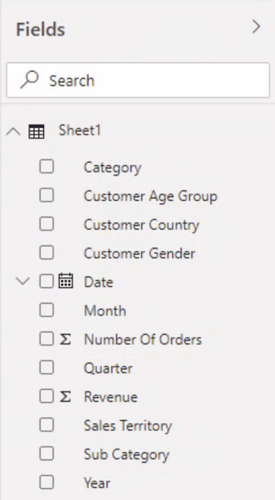
    <figcaption style="text-align:center;">Figure 1<figcaption>
</figure>

Note that double-clicking fields in Power BI does not automatically add them to the canvas. Instead it allows you the ability to rename the field if you so choose.

<figure>
    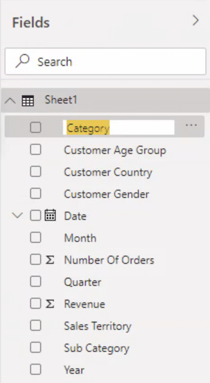
    <figcaption style="text-align:center;">Figure 2<figcaption>
</figure>

The easiest way to get started is to select a field of data and drag it onto the **Canvas**.

<figure>
    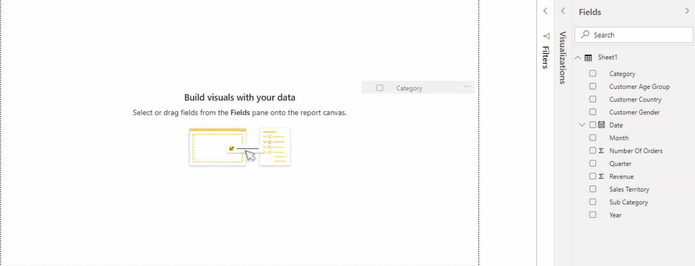
    <figcaption style="text-align:center;">Figure 3<figcaption>
</figure>

Once released, Power BI will create the best visualization based on the information currently provided. In this case **Mont** included **Text** values so Power BI chose to create a table.

<figure>
    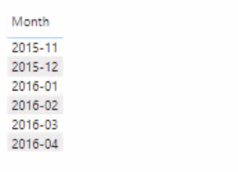
    <figcaption style="text-align:center;">Figure 4<figcaption>
</figure>

We will drag and drop a numeric field like **Revenue** on top of the table. You will notice that it adds the aggregatve value to the table instead of changing the chart type like Oracle Analytics Cloud. Power BI believes that you should deliberately change visuzations types after the default is generated.

<figure>
    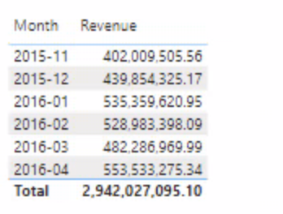
    <figcaption style="text-align:center;">Figure 5<figcaption>
</figure>

If you want to change the visualization type then we need to look to the **Visualizations Pane**. This pane will allow us to change the visualization type from the currently selected **Table** to any other type. Lets selected the **Grouped Column Chart**. This is the Power BI name for a traditional vertical bar chart.

<figure>
    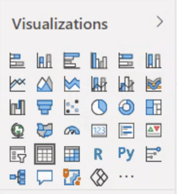
    <figcaption style="text-align:center;">Figure 6<figcaption>
</figure>

We now have a vertical bar chart of the **Revenue** by **Month**. You'll notice that Power BI by default sorts the bars in descending order instead of by the month labels. We'll discuss later how to change this. 

<figure>
    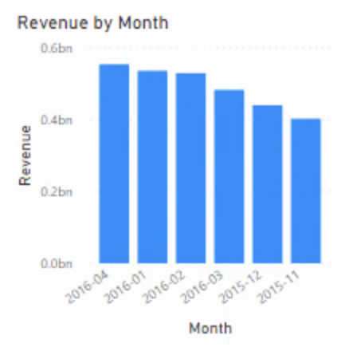
    <figcaption style="text-align:center;">Figure 7<figcaption>
</figure>

The original chart created may not be very large, and by default Power BI might angle our x-labels to ensure they don't overlap. Instead lets enlarge the visuzlation to be half of the canvas. While selected on the chart you will notice 8 grey handles around the edge of the chart. Grab one of the corners and drag it until the visulization takes up half of the canvas.

<figure>
    
    <figcaption style="text-align:center;">Figure 8<figcaption>
</figure>

Our resulting chart now has taller bars and our labels are able to be horizontal without overalpping.

<figure>
    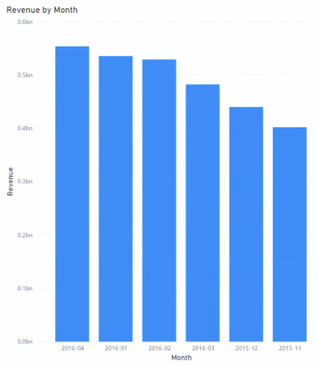
    <figcaption style="text-align:center;">Figure 9<figcaption>
</figure>

Another way to add a new visulization to the **Canvas** is to select the fields and the chart type we would like from the **Fields** and **Visualization** pane. As we select **Customer Age Group**, **Revenue**, & a **Donut Chart** you will see the canvas updating for each item.

<figure>
    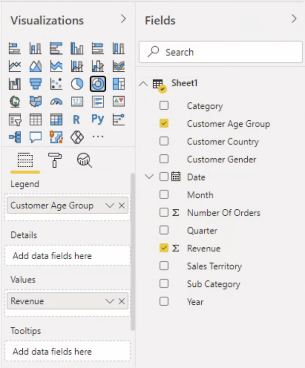
    <figcaption style="text-align:center;">Figure 10<figcaption>
</figure>

After making all 3 selections we'll be left with our donut chart placed in the open canvas space. Power BI will always place new charts in open space and estimate the shape and size of the chart. 

<figure>
    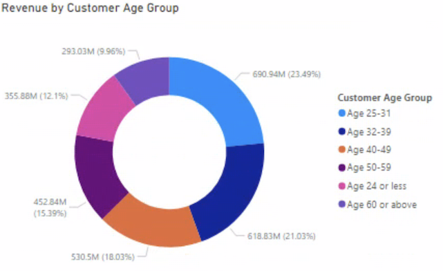
    <figcaption style="text-align:center;">Figure 11<figcaption>
</figure>

## Customizing

When we want to customize our individual visualizations we can do so in the bottom half of the **Visualizations Pane**. In this area there are 3 options: Fields, Format, & Analytics. In the **Fields** section we see the parts that make up the viz, potentially with openings where we can drag and drop additional fields.

<figure>
    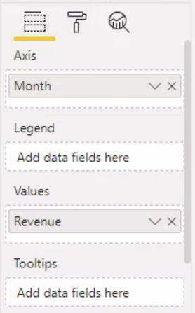
    <figcaption style="text-align:center;">Figure 12<figcaption>
</figure>

If we drag **Category** over and drop it in the **Legend** field we'll see that it adds **Category** to a viz with a separate color for each unique value. 

<figure>
    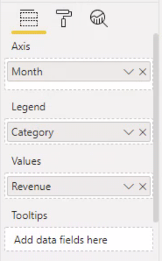
    <figcaption style="text-align:center;">Figure 13<figcaption>
</figure>

<figure>
    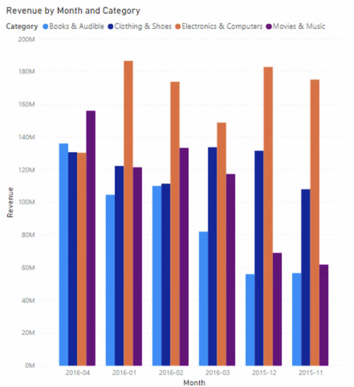
    <figcaption style="text-align:center;">Figure 14<figcaption>
</figure>

On the **Format** tab we can make selections that visually customize our charts. This can include a multitude of items such as adding or remove legends, axes, & labels to the ability to control the colors and location of the viz on the canvas.

<figure>
    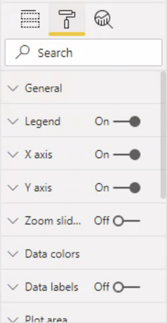
    <figcaption style="text-align:center;">Figure 15<figcaption>
</figure>

<figure>
    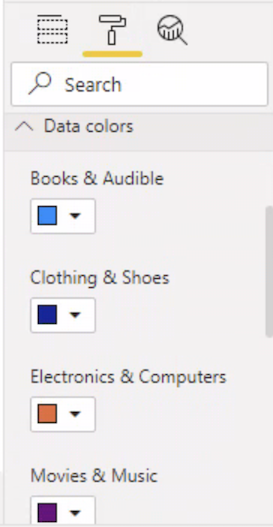
    <figcaption style="text-align:center;">Figure 16<figcaption>
</figure>

Here we will update our chart to be **Horizontal Bars**, turn off the **X-axis**, and turn on the **Data label** to see if this will be a cleaner way to visualize our data. Remember to always consider the data-to-ink ratio and how less can be more powerful.

<figure>
    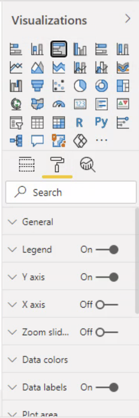
    <figcaption style="text-align:center;">Figure 17<figcaption>
</figure>

<figure>
    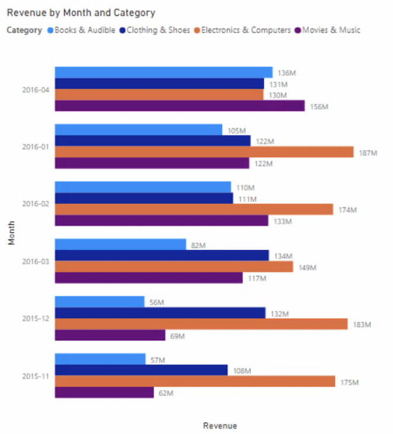
    <figcaption style="text-align:center;">Figure 18<figcaption>
</figure>

The last tab in the **Analytics** tab. Not all visuzliation types have options in this tab, but if they do it will allow adding calculated statistical values to the visualization.

<figure>
    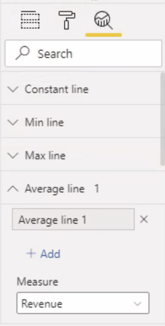
    <figcaption style="text-align:center;">Figure 19<figcaption>
</figure>

Perhaps we want to inlcude the **Average Revenue** to provide an easy visual distinction of which categories in which months are performing above average. 

<figure>
    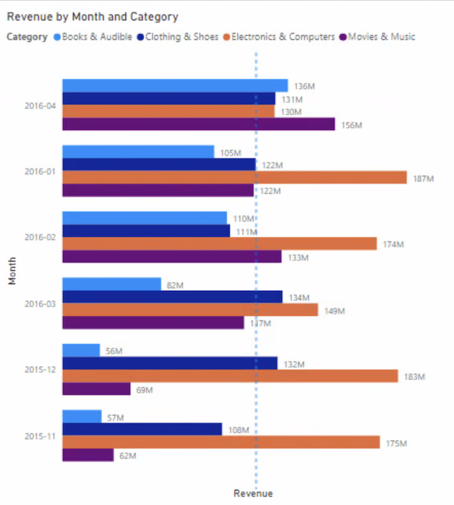
    <figcaption style="text-align:center;">Figure 20<figcaption>
</figure>

The last way we can add a new visualization to the canvas is to double-click on the visualization type. This will generate a blank visualization where we will manually populate the **Fields tab**.

<figure>
    
    <figcaption style="text-align:center;">Figure 21<figcaption>
</figure>

<figure>
    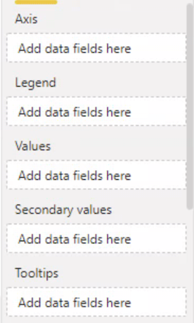
    <figcaption style="text-align:center;">Figure 22<figcaption>
</figure>

Here we will bring **Date** to the **Axis** value and the **Number of Orders** to the **Values** box.

<figure>
    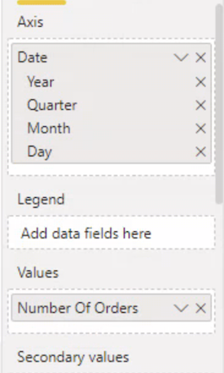
    <figcaption style="text-align:center;">Figure 23<figcaption>
</figure>

At first this may not genreate the type of line chart you expected. What we end up with is a line and two categorical values for our two years. 

<figure>
    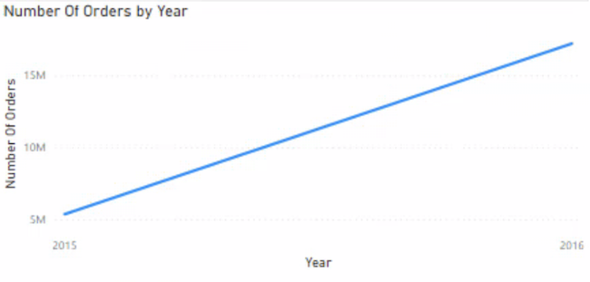
    <figcaption style="text-align:center;">Figure 24<figcaption>
</figure>

The reason our line chart is grouped by year is the type of date field is discreate instead of continuous. Select the dropdown arrow next to **Date** and select the option **Date** instead of **Date Hierarchy**.

<figure>
    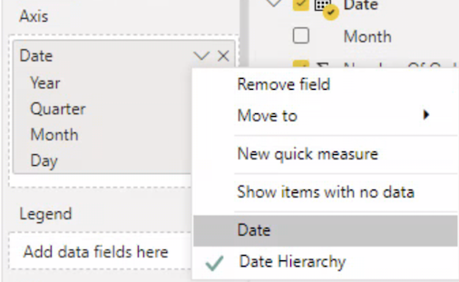
    <figcaption style="text-align:center;">Figure 25<figcaption>
</figure>

Now we have a line chart representing each individual day within our dataset.

<figure>
    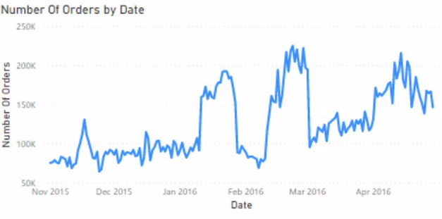
    <figcaption style="text-align:center;">Figure 26<figcaption>
</figure>

## Sorting & Filtering

To filter our visulization or the full page we need to use the **Filters Pane**. 

<figure>
    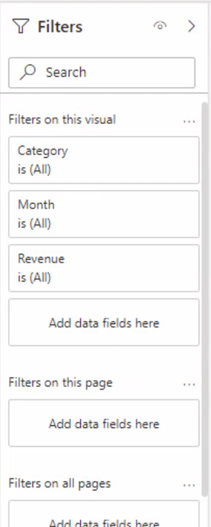
    <figcaption style="text-align:center;">Figure 27<figcaption>
</figure>

When a visualization like our bar chart is selcted, the top portion of this pane will show the fields that can be filtered upon. To test this we will filter the **Category** field for only the values **Clothing & Shoes** & **Electronics & Computers**.

<figure>
    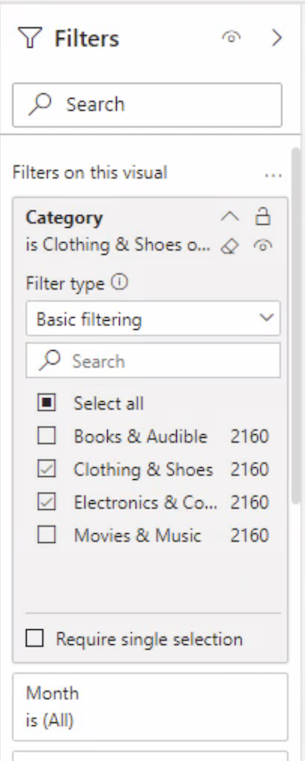
    <figcaption style="text-align:center;">Figure 28<figcaption>
</figure>

Our bar chart is now updated to only inlcude the two categories we selcted. 

<figure>
    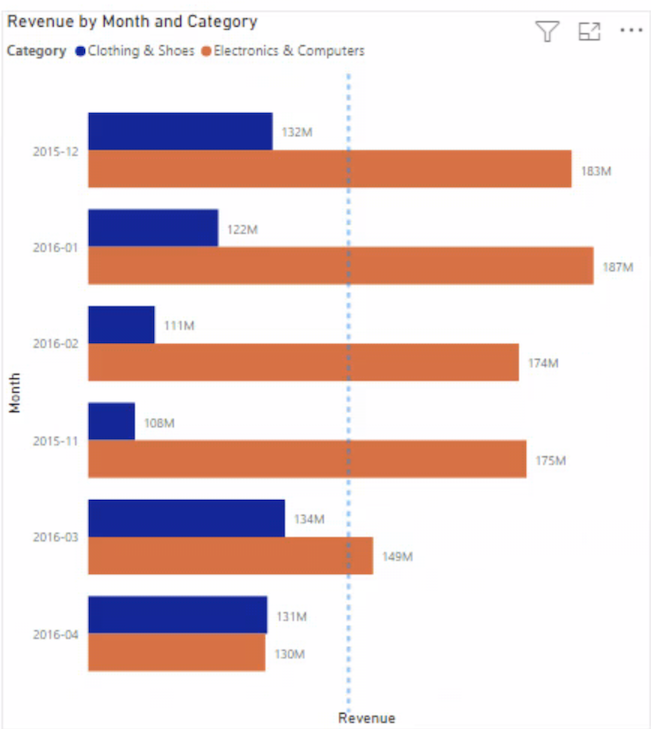
    <figcaption style="text-align:center;">Figure 29<figcaption>
</figure>

If we would like to filter all the visulzations on the page we can scroll down to the bottom half of the **Filters Pan** and drag a field like **Year** into the **Filters on this page** section. We will select  2016 to filter the whole page on.

<figure>
    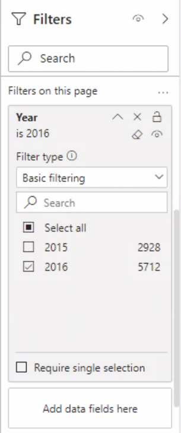
    <figcaption style="text-align:center;">Figure 30<figcaption>
</figure>

You'll notice the bar chart now has 4 groups for the 2016 months and the line chart starts in 2016.

<figure>
    
    <figcaption style="text-align:center;">Figure 31<figcaption>
</figure>

To sort a visualiztion is easy. In the upper right-hand corner of the visualization select the three dot ellipses. A dropdown list will appear with **Sort descending** and **Sort ascending**.  Select **Sort ascending** and see what happens. Notice how the months are out of order but the **Electronics & Computers** category is sorted with the smallest on the bottom and largest on top. 

<figure>
    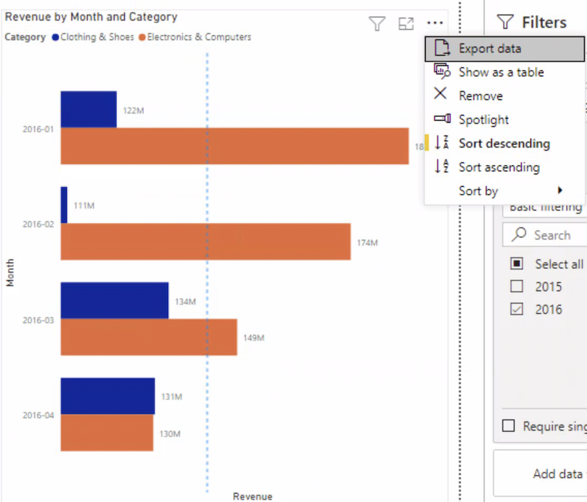
    <figcaption style="text-align:center;">Figure 32<figcaption>
</figure>

To fix this and sort by our month values we need to enter the dropdown list again. At the bottom is an option for **Sort by**. Here we can selcted **Month**.

<figure>
    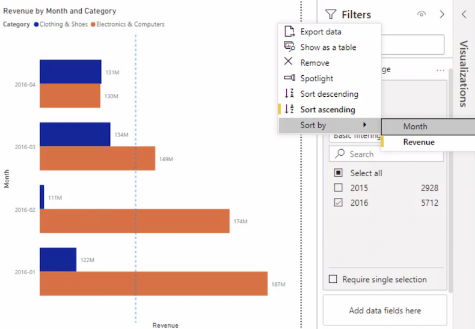
    <figcaption style="text-align:center;">Figure 33<figcaption>
</figure>

 Now the month labels are placed in chronological order.

<figure>
    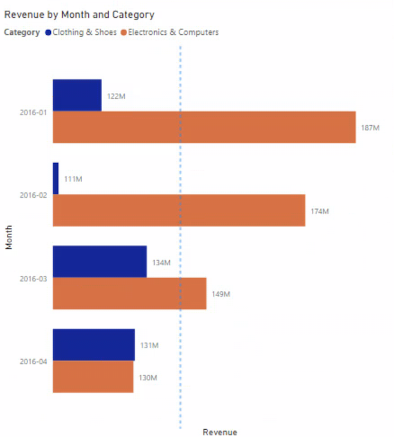
    <figcaption style="text-align:center;">Figure 34<figcaption>
</figure>

## Saving & Sharing

We have a couple of options to save the Power BI report. The first is to select the **Save Disk** icon in the upper left-hand corner of the application. 

<figure>
    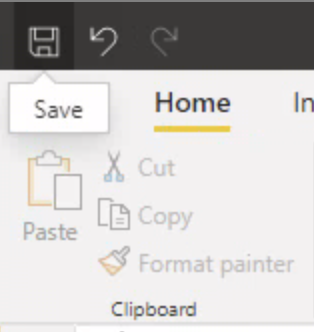
    <figcaption style="text-align:center;">Figure 35<figcaption>
</figure>

Once selected we will be asked to give the file a name and save it as a **.pbix** file type. Here we will name the program **Sales_Analysis.pbix**.

<figure>
    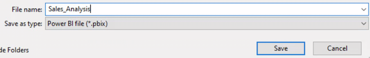
    <figcaption style="text-align:center;">Figure 36<figcaption>
</figure>

A second option to save the report, or save with a different name, is to selcte the **File** tab from the ribbon and then to select **Save as**.

<figure>
    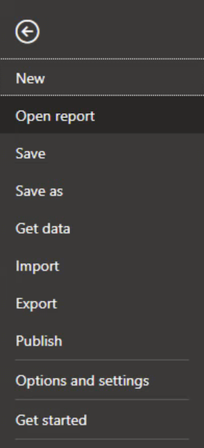
    <figcaption style="text-align:center;">Figure 37<figcaption>
</figure>

Once the report is saved we can now share our work with others. Sharing only work this way if you have a Power BI pro account. Otherwise you will need to share the **.pbix** report file along with the datasets. Here we will click on the **Publish** button in the ribbon.

<figure>
    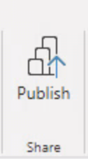
    <figcaption style="text-align:center;">Figure 38<figcaption>
</figure>

If you are not logged into your Office 365 account with Power BI Pro, you will be asked to do so now. 

<figure>
    
    <figcaption style="text-align:center;">Figure 39<figcaption>
</figure>

After you are logged in you will need to select the destination of where to publish the report on Power BI Online. In our case we will leave the selected as **My workspace**.

<figure>
    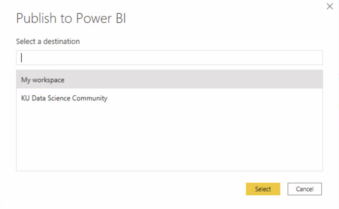
    <figcaption style="text-align:center;">Figure 40<figcaption>
</figure>

Once the publishing is complete a link will be proivded to go directly to the published report. Click the link and wait for the browser to bring you to the report page. You may be asked to login and verify your Office 365 credentials again.

<figure>
    
    <figcaption style="text-align:center;">Figure 41<figcaption>
</figure>

Once you are able to access Power BI Online you will be presented with your report on the main page.

<figure>
    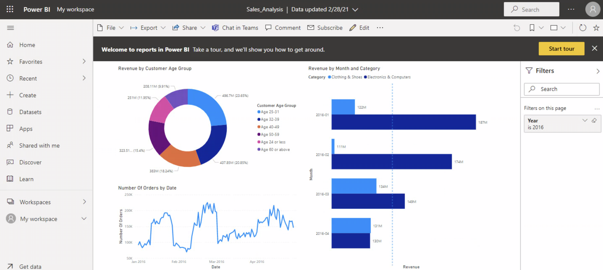
    <figcaption style="text-align:center;">Figure 42<figcaption>
</figure>

If you are presenting this report you can expand the report to be **Full screen** by selected the rectangle drop down in the upper right-hand corner of the screen and make the selction.

<figure>
    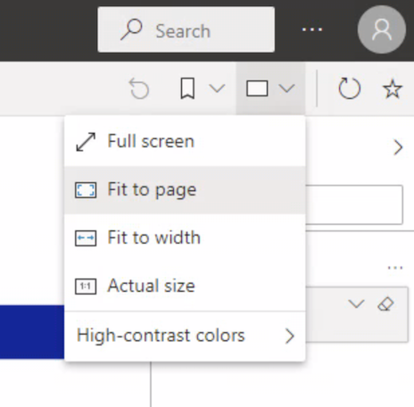
    <figcaption style="text-align:center;">Figure 43<figcaption>
</figure>

Notice how the report now takes up the full screen except for the **Filter** options that can be collapsed to the right side of the screen.

<figure>
    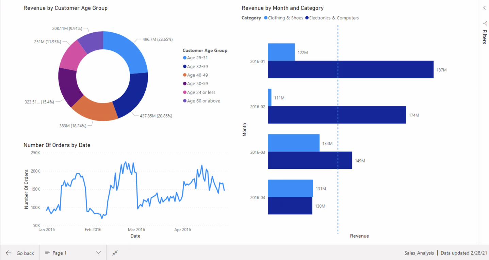
    <figcaption style="text-align:center;">Figure 44<figcaption>
</figure>

Finally if we want to **Share** the report with others, on the Power BI Online page there is a **Share** icon where we can select to email a link with access to any users we would like. This same menu has options for exporting differnt file types, downloading the project file, and more.

<figure>
    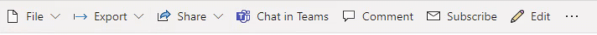
    <figcaption style="text-align:center;">Figure 45<figcaption>
</figure>

We've now create our first Power BI Data Visualization and can now share it with anyone else in our Office 365 ecosystem!