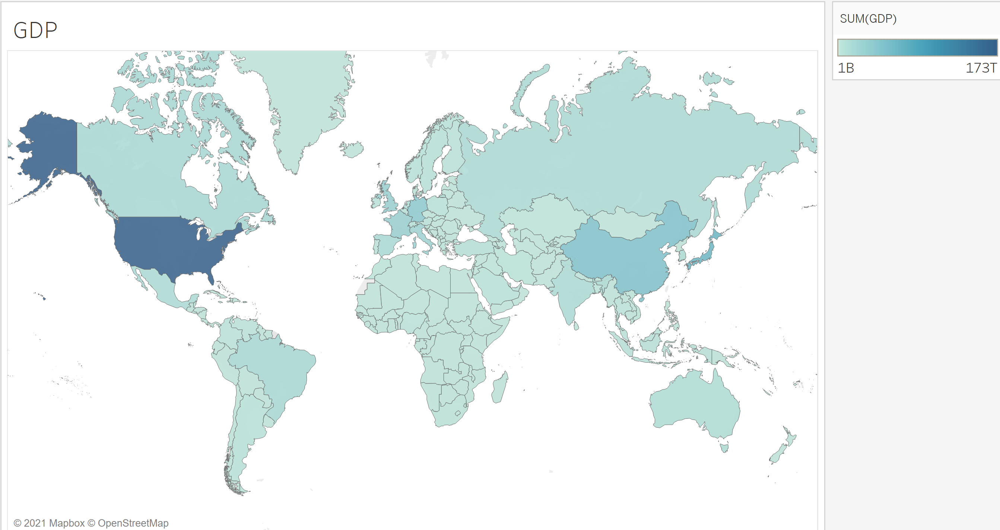
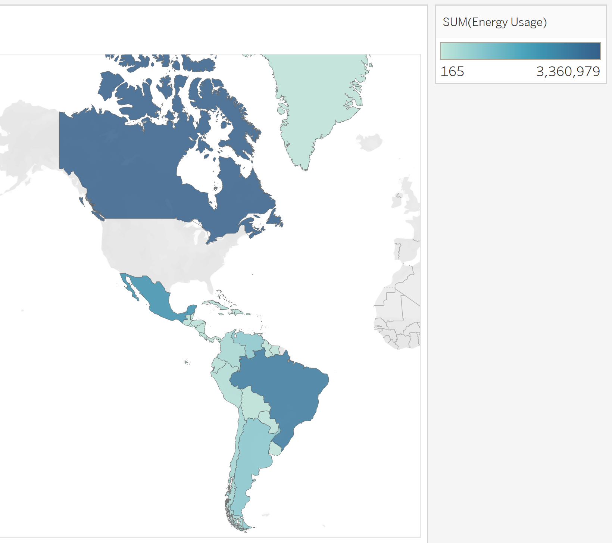
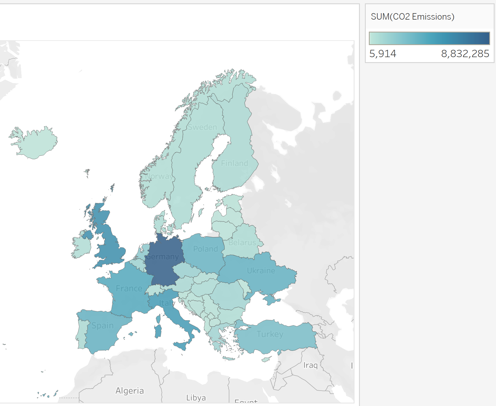
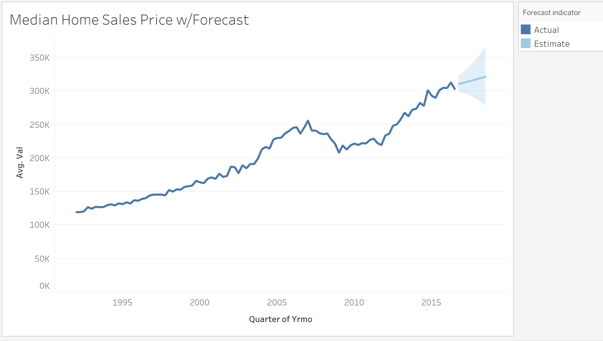
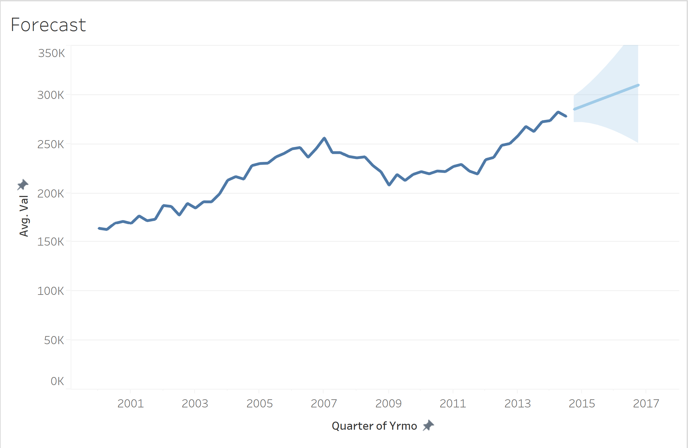
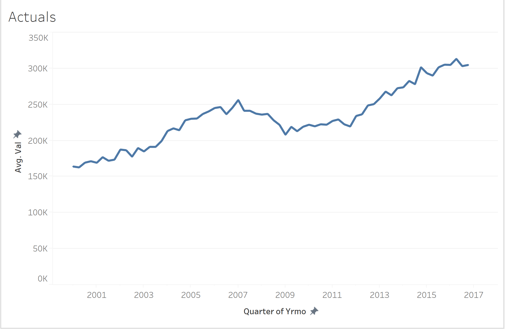
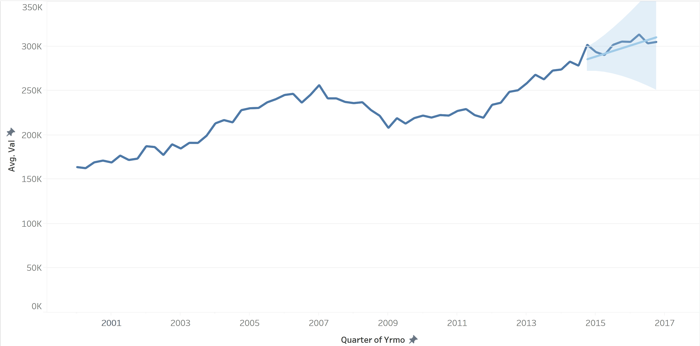

## Part 3 - Maps & Forecasting

This section focuses on the creation and customization of visualizing maps and forecasting with time series data.

## Mapping

Data:
[Donations.xls](mapping/Donations.xls) 

Creating maps in Tableau is an extermely easy endeavor, however, to control the design and formatting takes an understanding of numerous topics. The ease of generating maps in Tableau is due to the inclusing of Tableau generated measures of Longitude and Latitude, plus the inclusion of shape files. Shape files are images that are the shape of different geograpic areas such as Country, Region, State, and even Zip Codes among others. 

Lets start by double clicking `Longitude (Generated)` & `Latitude (Generated)`. The reason I recommend clicking the pills instead of dragging and dropping is that Tableau will automatically put them in the correct place to generate a map, and if you manually place them in the wrong area a Scatter Plot is generating instead of a map.

Once the map is generated we can start to add fields that will fill in the map. The fields we will focus on are the Dimensions with the `Geographic` icon and measures to aggregate. 

Double clicking on a `Geographic Dimension`, like `State`, might not return what you would originally expect. Normally Tableau will place circles on each point of interest. Tableau places the field on the `Details` section of the `Marks Cards`to tell Tableau how to summarize measures. You'll also notice that at the top of the `Marks Cards` there is a drop down that is currently set to `Circle`. The option of `Circle` may make sense when we are using points to represent a `Non-Geographic Shape` point like the location of a company's stores or Cities. 

If we select the drop down we can change it from `Circle` to `Map`. This will then generate shapes matching the `Geographic Dimension` field with all filled in blue. We're now one step closer to creating a map that tells a story geographically.

The last step for a simple map is to place a `Measure` on the `Colors` section of the `Marks Cards`. This will automatically color all of the states that have a matching record. As usual Tableau will start with the aggregation of the `SUM()` of the selected `Measure`. At the same time Tableau will generate a legend with a spectrum of values from the minimum to the maximum. This can be altered many ways, including to be solid colors with bands of values. We'll talk about this concept later as it is common across multiple chart types. 

If we wanted to go back to circles and represent the different `Cities` in our dataset we can place the `City` dimension pill on the `Details` pane of the `Marks Cards`. Notice how it retains the color spectrum but the minimum and maximum values may change with the lower lever of detai for the aggregation. 

Instead of usings `Color`, we can also represent the measure for each `City` by `Size`. If we drag the `SUM(Gift Amount)` to the `Size` panel in the `Marks Cards`. We now see the circles change size and all return to the same shade of blue. We can see that `Denver` is the largest circle even though `California` previously was the largest by `State`.

Another neat feature that comes with Tableau maps is the ability to include US Census data on different measuers and levels. Click on the `Map` menu at the top of the screen we can find `Map Layers`. This will open a menu on the left hand side of Tableau with numerous options. We can turn on and off differnt map features like the outline of differnt shapes or names. We can also control the color scheme and what base map information si used. 

At the bottom the `Data Layer` section provides the option to select a layer of values like `Population` by a specific geographic shape like `State`. This can allow us to remove base map layers but still include the shape of states using the population data. 

The final basic, however, difficult feat to accomplish with Tableau maps is to incldue two `Measures` at different levels of detail. These are what we refer to as a `Dual Axis` map. We now need to drag and drop `Longitude` and `Latitude` to columns and rows so that a grid of 4 maps is generated. From here, click the drop down on the second `Longitude` and select `Dual Axis`. Do the same for `Latitude` and you will notice we return to a single map.

Additionally, you'll notice that in the `Marks Cards` that there are now 3 drop downs. The first represents `Marks Cards` that control all map items. The second and the third are currently identical but allow us to make changes and visaulize two differnt maps on top of each other. Lets open the second menu where we will collapes the `State` detail and drage the `SUM(Gift Amount)` to `Color`. Now we have a map of `States` colored by our measure and circles with size representing our measure by `City`.  

<!-- <figure>
    
    <figcaption style="text-align:center;">Figure 26<figcaption>
</figure> -->

## Mapping Activity

Data:
[World_Indicators.csv](mapping/World_Indicators.csv) 

Using the World Indicators dataset generate the following maps to show GDP, Energy Usage, and CO2 Emissions are measured by the World Bank.

1. Generate a Map of countries colored by total GDP.

2. Create a Map of Energy Usage for North and South America, excluding the U.S. to see how all other Americas countries compare.

3. Map the CO2 Emmisions of the European Region and be sure to exclude Russia.

## Forecasting

Data:
[Stocks.csv](mapping/Stocks.csv) 

Just like mapping, Forecasting in Tableau can be very simple to start, but there are numerous moving pieces to consider to produce relevant results. 

We'll use stock market data to explain these concepts as they provide a good example of time series datasets with no gaps. The data from this lesson was exported from Yahoo Finance by Month dating back to 1997. This lesson is not intended to provide financial advice as it simply shows the ability with very little varicty behind the analysis. 

Before we can forecast data we first must create a line chart of our current dataset. We'll start by filtering the dataset to only Amazon with the ticket `AMZN`. With our data filtered we can place the `Date` dimension in the `Columns` section and `SUM(Close)` in the `Rows`. This will generate a discrete chart, however, we will want it to be continuous. Additionally, because our data is provided at the monthly level we will drill to the level of `Quarter`. We need to ensure we change `SUM(Close)` to `AVG(Close)` since oru final quarter does not have all 3 months included and will give us a more accuracy view of the price change over time in general. 

From here we can add our `Forecast` by selecting the `Analysis` menu and look for the `Forecast` option. We will start with the default options and simply select `Show Forecast`. We now have a `naive` forecast through `Q4 2022`. 

We can control the forecasting to an extent by returning to the `Analysis` menu `Forecast` selection where we will find `Forecast Options`. In the window that opens we can see the controls available, including how many time series segements to project forward. We also see the option of showing the confidence intervals band to see how confident the model is on the prediction. At the very bottom is a written description of how the data was used and analyzed when generating the model. 

This is also where we can take greater control of how the function treats Seasonality, Trend, and which segments of time to use to perform the rolling analysis. This is beyond the scope of this course as we could spend an entire semester on the subject so we will leave the default values.

Next, we'll see how the forecasting works for multiple dimensional values by adding Stock to Rows and removing our filter on stock symbol to show both Amazon and Apple stocks. We now have a separate line chart for each stock with their individual forecasts. However, the forecast for Apple is less noticable because of the very high value of Amazon stock. To fix for this we will right-click on the Apple y-axis, select `Edit Axis`, and finally choose `Independent axis ranges for each row or column`. This will allow each line chart to have it's own default y-axis values. Now we can see Apple's forecast. 

<!-- <figure>
    
    <figcaption style="text-align:center;">Figure 34<figcaption>
</figure> -->

## Forecasting Activity

Data:
[Median Home Sales Prices.csv](forecasting/Median_Home_Sales_Prices.csv) 

Using the Median Home Sales Prices in the US dataing back to 1900, generate the following forecasts. 

1. Generate a quarterly forecast of Median Homes Sale Prices Values (Val) for 8 quarters. Additionally, only show data from the past 30 years relative to Today.

2. Generate a quarterly forecast with data filtered from January 1st, 2000, through December 31st, 2014, that will forecast for 9 quarters. Update the X-Axis to span from 1/1/2000 through 12/31/2017.

3. Create a line chart of actual Median Home Sales Price valuse starting from January 1st, 2000, till the end of the file. Update the X-Axis to span from 1/1/2000 through 12/31/2017.

#### Bonus

The purpose of charts 2 & 3 from the activity are to compare forecasts to actual values to see how well the naive model performs with known future data.

Stack these charts on top of each other in a Dashboard usings the `Floating` option to see the comparison. 

<!-- <figure>
    
    <figcaption style="text-align:center;">Figure 45<figcaption>
</figure> -->

