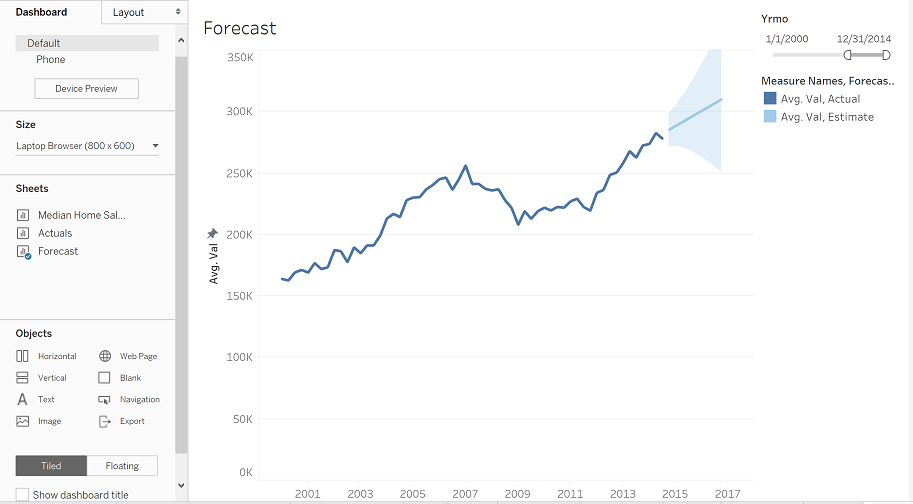
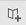
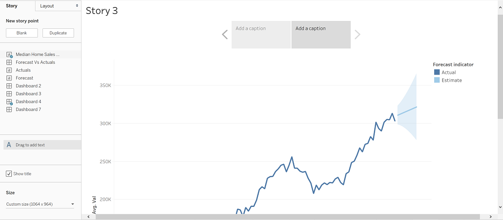

## Part 4 - Dashboards & Storyboards

This section focuses on the creation and customization of Dashboards and Storyboards.

## Dashboards

Data:
[Median Home Sales Prices.csv](forecasting/Median_Home_Sales_Prices.csv) 

Creating dashboards in Tableau is even easier than creating a Map, however, to style and organize a dashboard to tell a cohesive story is more of an art than a science. Dashboards allow you to put multiple visualization worksheets on a single page together and can even allow them to interact with one another. To start we need to click the New Dashboard button in the tab section. 

<figure>
    
</figure>

Once the dashboard is generated we can see the menus and options are quite different than a worksheet. Instead of fields to be added to the page we have visualization worksheets that can be added to the dashboard. Before we start adding visualizations to the dashbaord lets discuss the menus and options.

We can see that there are two tabs titled `Dashbaord` and `Layout`. The `Dashboard` tab will give us control over the the shape and content of the dashboard. In the `Size` section we can use the drop down to select different pixel sized options based on different predefined sizes or a custom `Width` and `Height`. Let's select `Laptop Broswer` (800 x 600) if not already selected. 

<figure>
    
</figure>

In the following section titled Sheets we can see a list of all worksheets previously created. These are visualizations we can add to the dashboard. Lets double-click the `Forecast` worksheet to add it to the dashboard. Notice how the visualization covers nearly the full dashboard except for the right edge that includes our filter and color legend. 

<figure>
    
</figure>

The reason the chart, filter, and legend cover the full dashboard is due to the option called `Tiled`. By changing the option to instead be `Floating` we can have complete control over the location and size of the chart elements. Click on the line chart and find the dropdown arrow in the top left corner and select `Floating`. Once this is done the dashboard will not look pleasing but if we continue with the same steps for both the filter and color legend we will be able to organize all three on the dashboard as desired. 

<figure>
    
</figure>

With each of the 3 chart elements we will see a grey tab appear at the top of each item when selected. We can use this to move the object around on the screen manually. Additionally, when each item is selected we can click on an edge or corner to drag and resize the object. This can be a good tactic when we are testing ideas on how to display the dashboard. Later we will cover how to control the location a size down to the individual pixel to create a `pixel-perfect` dashboard. 

<figure>
    
</figure>

Under the `Sheets` in the menu pane we have another section called `Objects`. These are different elements we can add to the dashboard that aren't a predefined worksheet visualization. Before we work with any of these items below you will see two buttons `Tiled` and `Floating` with the button `Tiled` selected. This is why our chart was originally added to the dashboard in `Tiled` mode. We will want to select `Floating` so all objects and charts we add in the future will default to `Floating` mode.

<figure>
    
</figure>

`Tiled` charts and elements can be difficult to oraginize and this is why `Horizontal`, `Vertical`, & `Blank` are provided. We will not delve into using these `Tiled` options and instead focus only on the `Floating` option. 

The additional objects include `Web Page`, `Text`, `Image`, `Navigation`, & `Export`. We'll review each of these briefly:

- Web Page: This allows the addition of a container pointing to a specific URL (e.g. www.Google.com).
- Text: We can add any amount of text in any format desired such as titiles, callouts, or explinations.
- Image: Either an image uplaoded from the computer or pointed to with a URL can be displayed.
- Navigation: This generates a button that can be altered with text and point to another worksheet, dashboard, or story.
- Export: This create a button that can be formatted and will, depending on export selection, allow for saving the dashboard, or possibly the whole workbook, as an image, pdf, or powerpoint file.

<figure>
    
</figure>

Now lets take a look at the `Layout` menu tab. Based on the currently selected item the `Position` and `Size` value will become available and can be altered. The `Position` option identifies the `X` & `Y` coordinates of the upperleft corner of the object. The `Size` option controls the `Width` and `Height` of the object which allows us to be exact on how much space of the dashboard is covered from the `Position` point.

<figure>
    
</figure>

If we scroll down we can see additional options for `Border`, `Background`, `Outer Padding`, & `Inner Padding`. Similar to Microsoft Excel the `Border` option allows of different style, size, and color. `Background` gives the selection of a color to fill the complete background of the visualation. This can be handy when there is a desire to organize and direct attention to specific charts together or separately. 

The `Inner` & `Outer` padding options allow for control of space between the visualationa and the border (`Inner`) and control of sapce between the border and other dashboard objects (`Outer`). These options are helpful to control the design and aesthetic of the overall dashboard. 

<figure>
    
</figure>

The last section is the `Item Hierarchy`. This works similar to how Microsoft prodcuts allow to stack items and control what is in front and back. In this list items at the top will be placed on top and the itesm at the bottom will be palce beneath other objects. To alter this you can drag and drop elements in the list, or in each objects drop down menu the option `Floating Order` allows to send objects forwards, backwards, and to the front or back. Controling the `Floating Order` is important when wanting to place filter and legend items on top of a visualization to maximize the whitespace. 

<figure>
    
</figure>

## Dashboarding Activity

Data:
[Median Home Sales Prices.csv](forecasting/Median_Home_Sales_Prices.csv) 

Using the `Forecast` and `Actual` charts generated in the previous `Line Chart` activites generate a dashboard to show the forecast and actual simultaneously. 

1. Place the `Forecast` visualziation on the dashboard as a Floating object. 

2. Place the `Actual` visualziation on the dashboard as a Floating object.

3. On each chart remove the `Title`.

4. Update the `Position` and `Size` of each chart to be identical, covering the full left half of the dashboard, and setting the floating order so that `Forecast` is on top.

5. Place the Filter and Legend above the chart.

6. Place the full dataset and forecast visualtions in the dashboard and set the size to cover the full right half of the dashboard.

## Storyboarding

Data:
[Median Home Sales Prices.csv](forecasting/Median_Home_Sales_Prices.csv) 

Storyboarding is very similar to dashboarding but with less options and more focused on the flow of the story. Like a worksheet a storyboard only allows one item to be placed on a single story page. However, these items include created dashboards which is how multiple visualizations can be added to single story page. To create a new story click the `New Story` tab and a blank story will appear.

<figure>
    
</figure>

The left menu, like our dashboard, includes a tab for `Story` and `Layout`. On the `Story` tab the first set of options is in the `New story point` section. The option of `Blank` and `Duplicate` simply allow for generating new or copied Storyboard pages. Beneath this section are all of the worksheets and dashboards created that can be added to the storyboard. The only additional item that can be added on top of the worksheet or dashboard is text using the `Drag to add text` object to add context.

<figure>
    
</figure>

Let's add our dashboard created in the previous activity to the storyboard.

<figure>
    
</figure>

Now we can add another `Blank` story page to add another empty page to add our previous worksheet with the full dataset and forecast.

<figure>
    
</figure>

Notice that the screen resolution is slightly different to accomodate for the Story Title and the caption boxes. The worksheets and dashboards will occupy the full size of the Story page, however, if the size is reduce below the dimension of the dashboard a scroll bar will be added.  

Now that we've added a worksheet, dashboard, and any annotation text, we can also update the caption in the box at the top of the screen that also acts as a button to move between storyboard pages. If more text is added than can be viewed in the box a scroll bar will appear. 

<figure>
    
</figure>

However, if we change the navigation style on the `Layout` tab the captions will disappear. For example if we select `Dots` we get simple cirlces that are a common visual for the ability to tab between multiple items. 

<figure>
    
</figure>

This concludes the simplicity of how Storyboards work, while providing a way to control the story and pages to be seen by the end user through the story interface.

## Storyboard Activity

Data:
[Median Home Sales Prices.csv](forecasting/Median_Home_Sales_Prices.csv) 

Using the charts and dashboard previously created with our Meian Home Sales Price data we will generate a story. 

1. On the first Story page place the Dashboard created previously.

2. Add a Text Box and include a short note about the accuracy of the Forecast compared to Actaul charts.

3. One the second Story page place the Worksheet contacting the full original dataset with forecast.

4. Add a Text box and include a short not about the confidence interval around the prediction.

5. Change the navigation style to `Dots`.

