## Part 5 - Heat Maps, Scatter Plots, and Calculated Fields

This section focuses on numerous topics including the creation and customization of Heat Maps, Scatter Plots, and Calculated Fields. All four topics will be covered with a single dataset, so all were included in this part of the walkthroughs. 

## Heat Maps (Highlight Tables)

Data:
[66045.csv](66045.csv) 

The dataset we will be using for the following activities is weather for the zip code 66045 that covers the University of Kansas campus. The weather data spans from January to August, 2021.

Heat Maps in Tableau are different than the typical visual expected in Business Analytics. What is typically considered a Heat Map by Business Analytics in Tableau is called a Highlight Table. This is important to note, so when discussing with business partners the expectations can be clear of the type of visualization to be produced. So althought we will be working with Tableau Highlight Tables, we will refer to them here on out as Heat Maps. 

Creating a heat map in Tableau is relatively easy, but requires specific steps to acheive the goal in the quickest manner. If different steps are taken you can still create the same heat map, it simply requires fixing the assumptions Tableau will make. 

To start we need to think about what the dimensions of the heat map will be to represent the columns and rows. For our weather dataset our goal will be to show the change in the **High** temperature by day. Therefore, we will use *Months* for columns and *Days* for rows. This will create a table with cells for each day in our dataset.

<figure>
    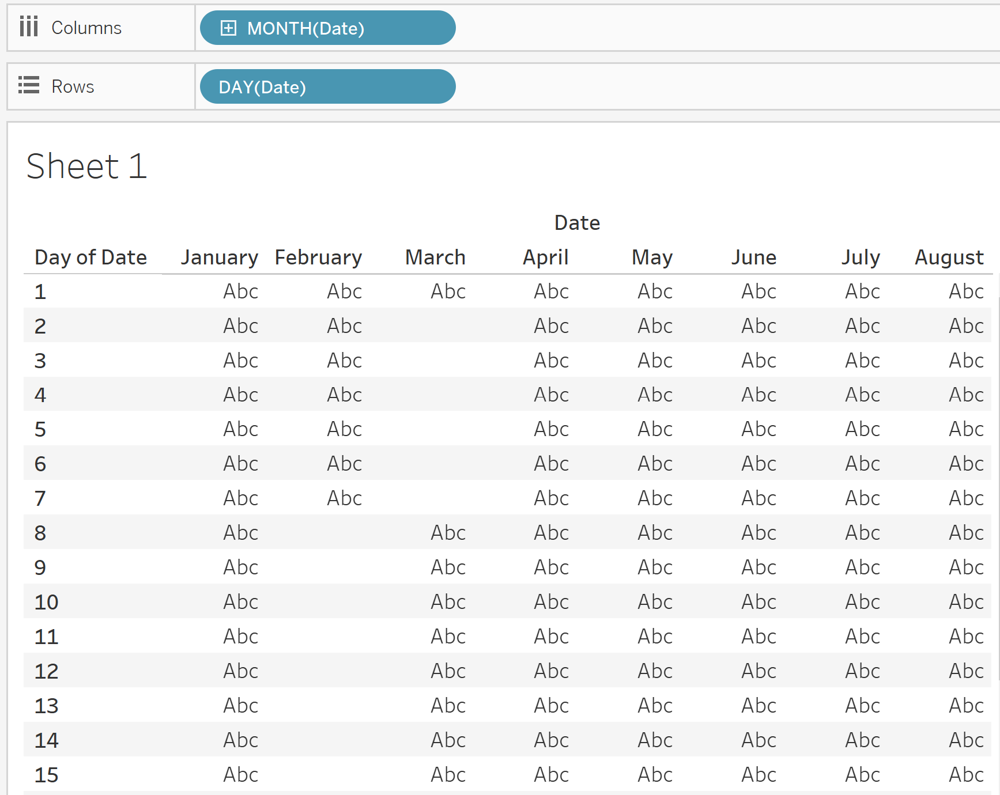
</figure>

You will notice first that not all of the cells have *abc* in them. This is due to the fact that our dataset is missing data for multiple days in February and March. This is a good time to note that when aggregating data a table format is a quick way to check for completeness of all pivots you expect to be in your dataset.

Our next step will be to place the measure we are aggregating the heatmap by into the **Text** & **Color** marks cards. In this case that will be **High** for the high temperature of the day. Additionally, we need to change the dropdown option from **Automatic** to **Square**. We can perform these 3 steps in any order and get the same result, but the images between will be slightly different. The following three images show performing the steps as stated above.  

<figure>
    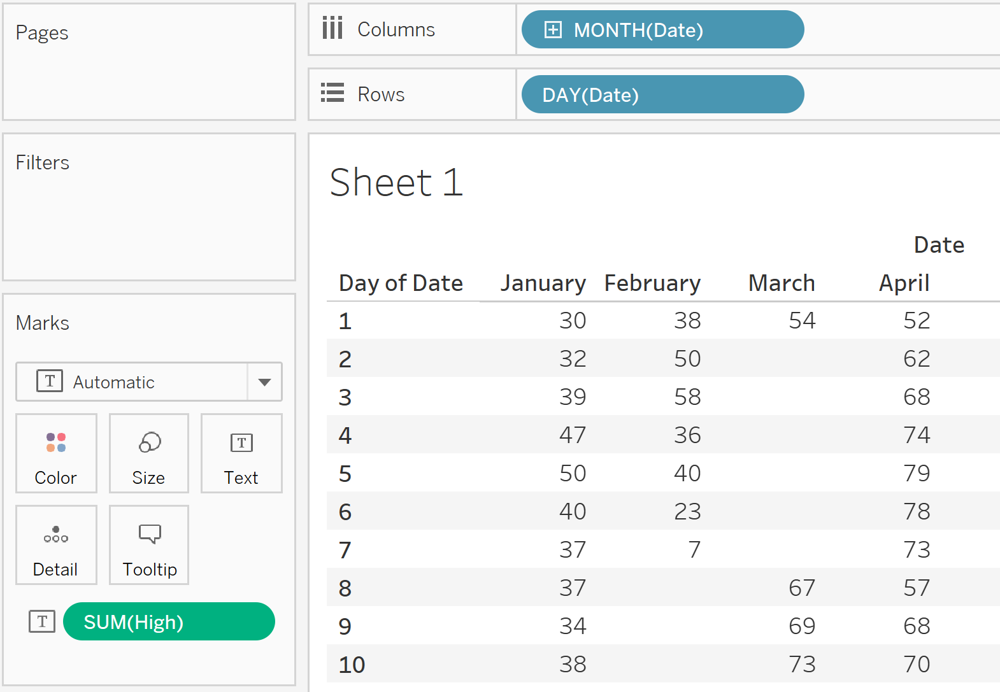
</figure>

<figure>
    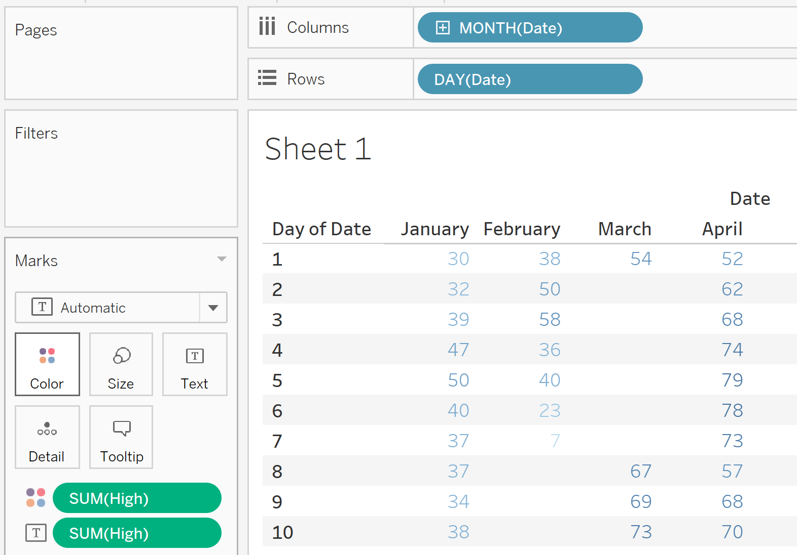
</figure>

<figure>
    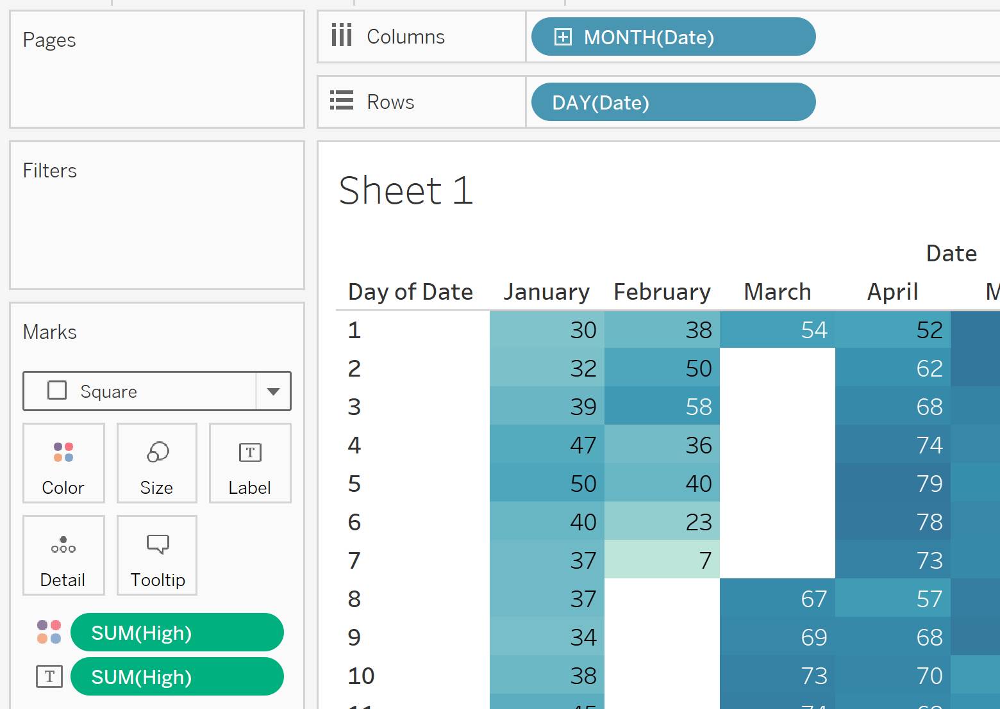
</figure>

We can see now that we've generated a heat map that is darker the larger the value and lighter the small the value. The **Text** labels are optional, but can help when distinguishing between two different cells. If you remove the **Text** label pill the values will still appear in the **Tooltip** when hovering over the cell, but they will have to be viewed one at a time. Lastly, you can also use a different Measure for the **Color** and **Text** if you wish to convey two values at once to be considered in combination.


## Scatter Plots

Scatter Plots are possibly the most common type of visualization when working with multiple measures. They are versitile and with formatting features can utilize up to four or five Measures within a single visualization. The most  basic version of a Scatter plot will create a point for each record at the level of detail desired. 

Our goal in this section will be to create a Scatter Plot showing a point for each day comparing the **Low** and **High** temperatures. To do this we will first place the **Low** and **High** Measures in the rows and columns space like the image below.

<figure>
    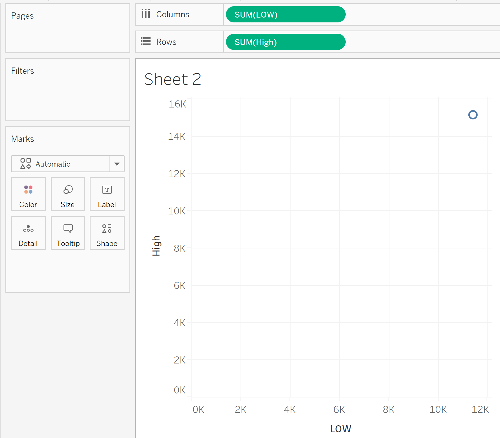
</figure>

This may seem wrong at first because we only see one datapoint, however, this is what we expect Tableau to do at this point. What has happen is Tableau generated a single point representing the **Sum** of the **Low** and **High** values for our full dataset. To show the results for each day individually we need to drag **Date** to the **Detail** card and select the *Continuous* Day option. This will ensure we have a datapoint for each day in our dataset rather than day numbers 1 through 31 aggregated.

<figure>
    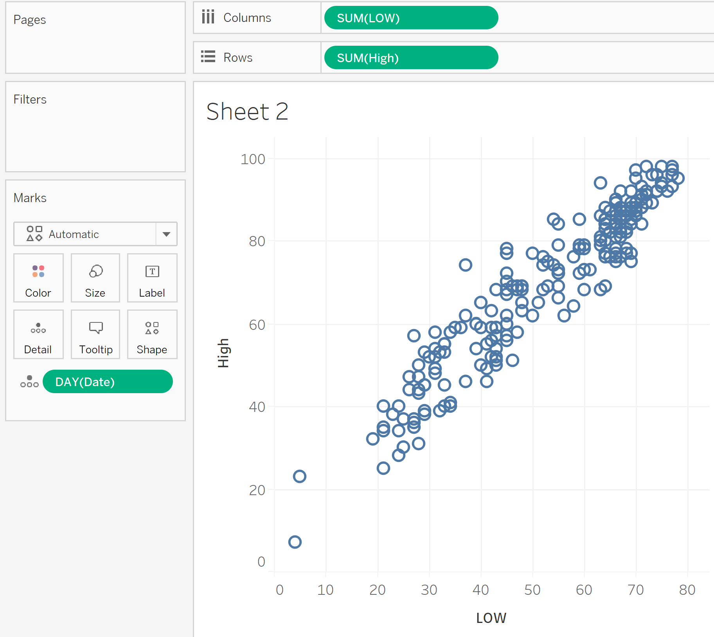
</figure>

We've now generated a Scatter Plot with empty Circles. These empty Circles are generated by the Automatic option selecting **Shape** in the Marks dropdown. We can change the drop-down value to be Cirle or Square to be a filled in shape or we can open the **Shape** Marks card and control what shape is used for each data point.

Instead of changing the shape we'll focus on how we can add more Measures to our chart. From this point it is very easy to add additional measures by dragging them to the **Color**, **Size**, or **Label** marks cards. For examples let's drag the **Preciptation** column to the **Size** marks card to see if there is any correlation between **High** & **Low** temperatures and **Precipitation**. In the image below we can see there appears to be a slight amount of correlation because first when the temperature is low enough we get **Snow** which is measured differently than **Precipitation**. Secondly we notice that the greatest amount of preciptation occured during one of the days in the upper rigth with a **High** of **98** and **Low** of **75**. 

<figure>
    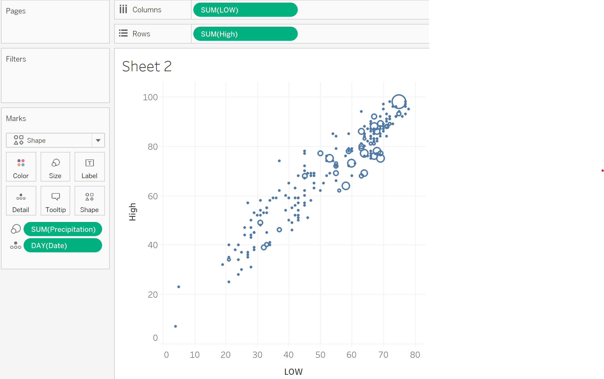
</figure>


## Calculated Fields

Calculated Fields are a feature Tableau offers that allows us to calculate different values based on our original source of data. This can be helpful to cleanse data or generate interactions between fields when we don't have the option in the original dataset. There are numerous ways to create a Calculated Field, however, we wil focus on the basic option. In the top menu bar select **Analysis** and from the list of options select **Calculated Field**. This will open a dialogue box to enter the calculation.

<figure>
    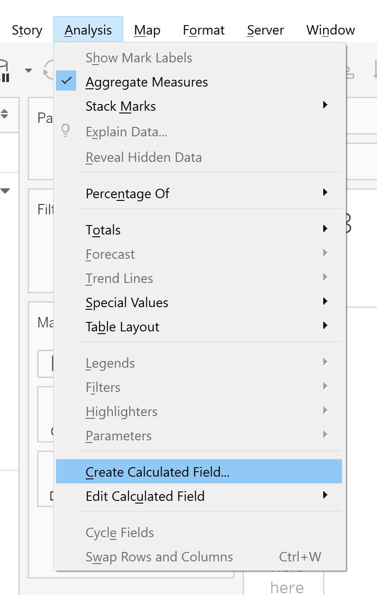
</figure>

<figure>
    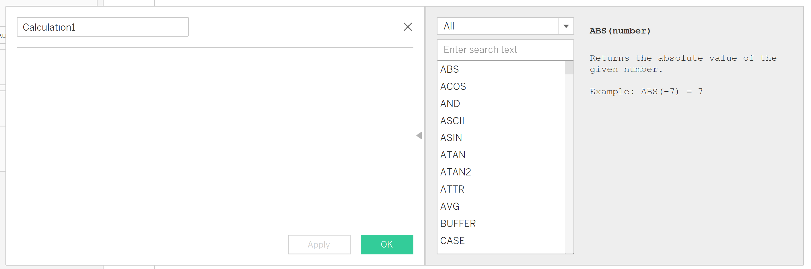
</figure>

In our Calculated Field dialouge we need to do two things. First we need to give a name to the calculation that will show up in the Dimensions and Measures area based on the type of data output. For this example we will calculated the **High to Low Ratio** of our temperatures so we will use this name. The second peiece we need to provide is the calculation. For the Calculation there are many differnt functions that we can use or we can simply perform mathematical calculations. In our case since we are calculation a simple ratio we'll use simple math and type in the code below adn click **OK**. The fields are placed in square brackets ([]) so that Tableau knows they are a Measure or Dimension.

```
[High]/[Low]
```

<figure>
    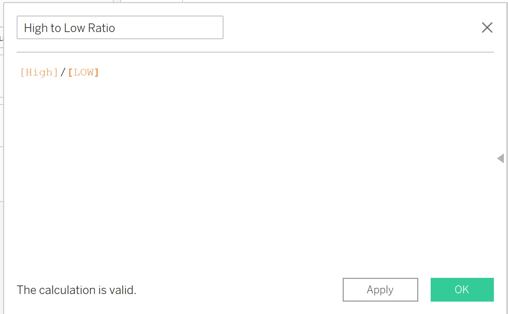
</figure>

We now have a new measure titled **High to Low Ratio** with a small equal sign next to the hash symbol to show that it's a calculated field. Now with this field we want to see a scatter plot showing the total **Precipitation** compared to the average our new calculation by **Month**. We'll place the **Precipitation** pill in the columns section and our calcualted field **High to Low Ratio** in the rows and change it's aggregation to **AVG()**. Next we'll place **Date** on detail like before and then select **Month**.

<figure>
    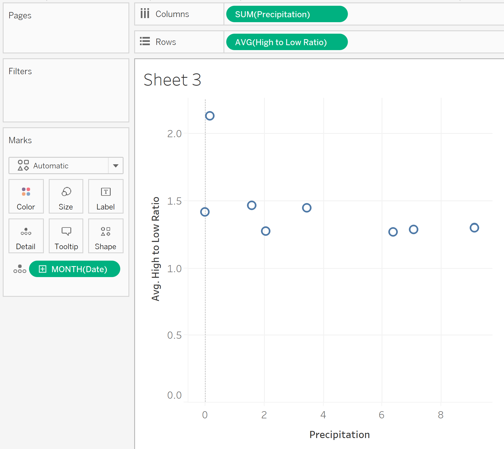
</figure>

We can see that there is pretty much no correlcation between our average **High to Low Ratio** and the amount of **Precipitation**. For all months except **February** (where we have limited data) the average ratio appears to be roughly between *1.3* & *1.5*. 

Sometimes however we actually need to have an aggregation performed at the level of detail before the calculation is performed. This most commonly affects calcualtions like ratios. If our intent instead was to calculate the total **High** & **Low** values for each month before performing division to get a single value for the month we need to change our calcuation. We'll create another Calcualted Field to see how these two methods perform differently. Select **Create Calcualted Field** again and this time call the calculation **High to Low Ratio Aggregate** and use the following code:

```
SUM([High])/SUM([LOW])
```
<figure>
    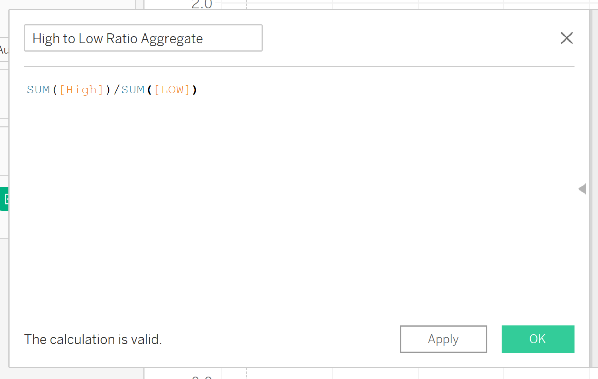
</figure>

This will create our new calcualted field that we can bring to our chart to see how the values are slighly different. We'll see this by dragging the **High to Low Ratio Aggregate** pill to the rows section next to our previous calculated field. This will create two charts where we can start to see the difference, but to see if more closely click the drop down on our new calcualtion and select **Dual Axis** to create one chart. 

<figure>
    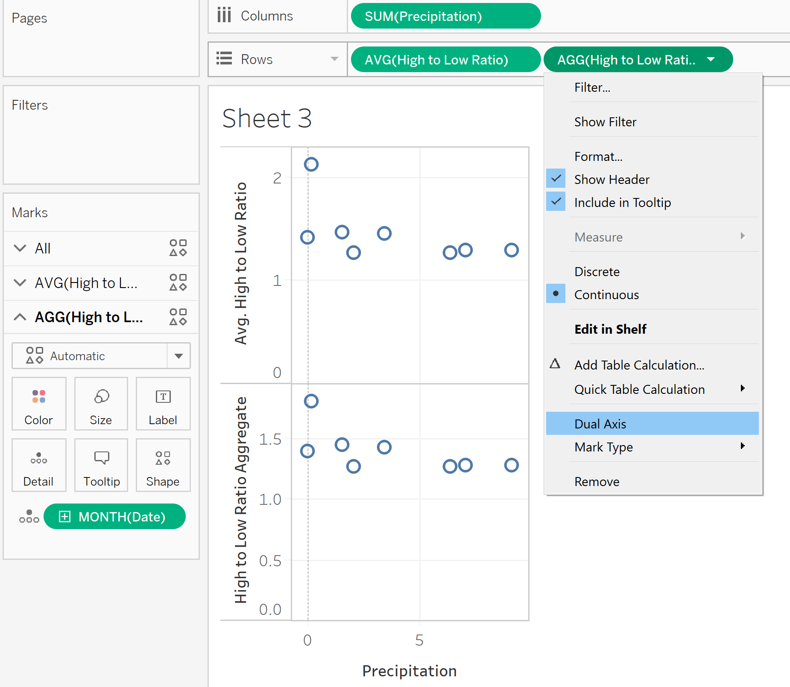
</figure>

Now we can see how the values differe slightly with each of the Orange and Blue circles being and slightly different places. However, we have two **Y-Axis*** values that aren't exactly the same meaning the two colored charts have a different axis. To fix this we will right click on the right axis and select **Synchronzie Axis** to see the final values and how they differ.

<figure>
    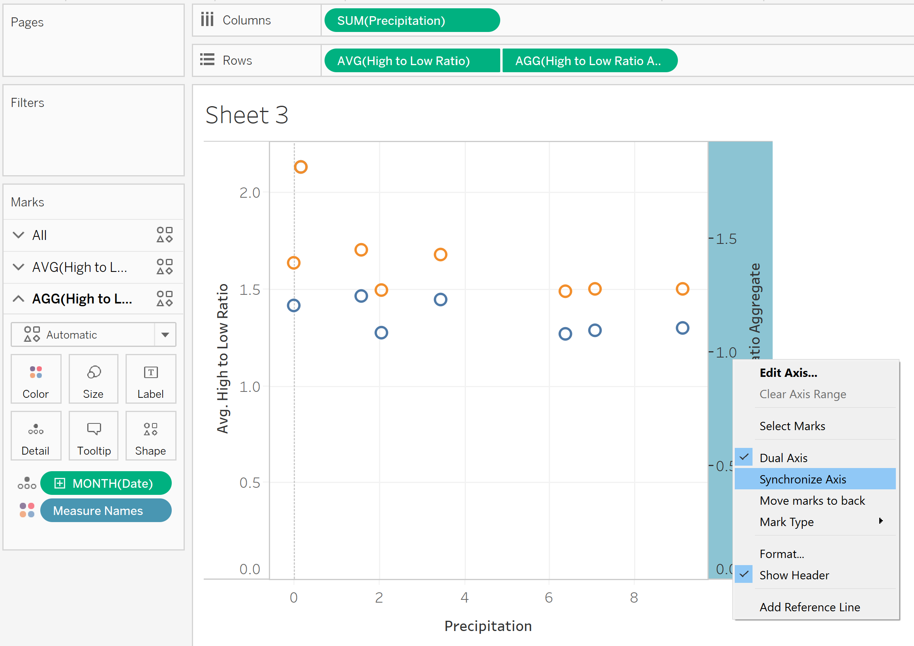
</figure>

We can see the resulting values are even closer to identical now, except for the values representing February are still far apart. The reason these values are so different is due to the point of time when we perform the aggregation compared to the calculation. Another thing we may have noticed is that our new **Aggregate** field doesn't give the option to select aggregation calcuations and instead begins with **AGG()** which stands for aggregate. This is due to the fact that we are performing aggregations during the calculation. 

<figure>
    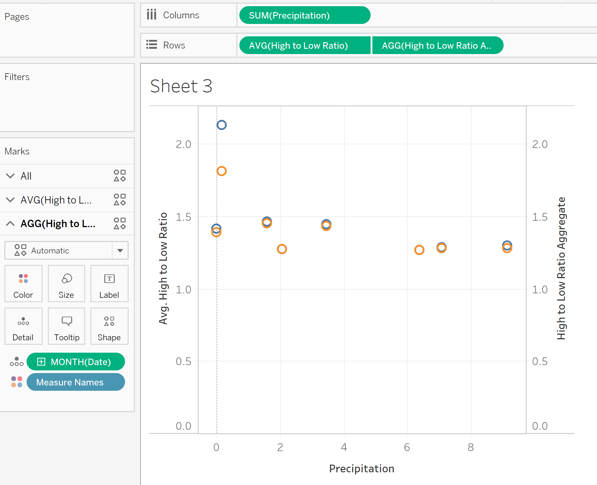
</figure>

In the end the decision of where it makes the most sense to perform the aggregation depends on the business question trying to be answered. Sometimes they will return the same value and other times they will differ like the example above. Lastly, to ensure you are getting the value you exepcted you can right-click on a single datapoint like *February* and select the option to **View Data**

<figure>
    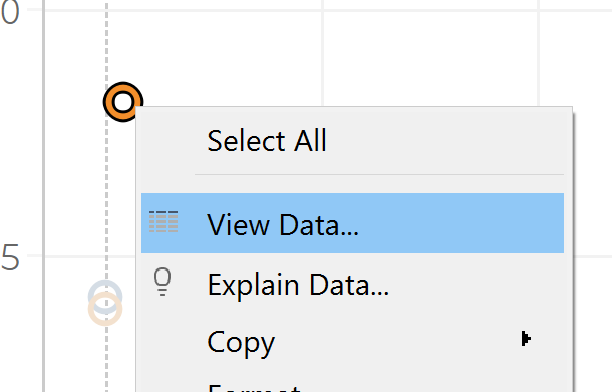
</figure>

By default the **View Data** option will show you the aggregated value returned. However, if you click the **Full Data** tab at the bottom left it will show you all of the individuals records that were used during the aggregation. 

<figure>
    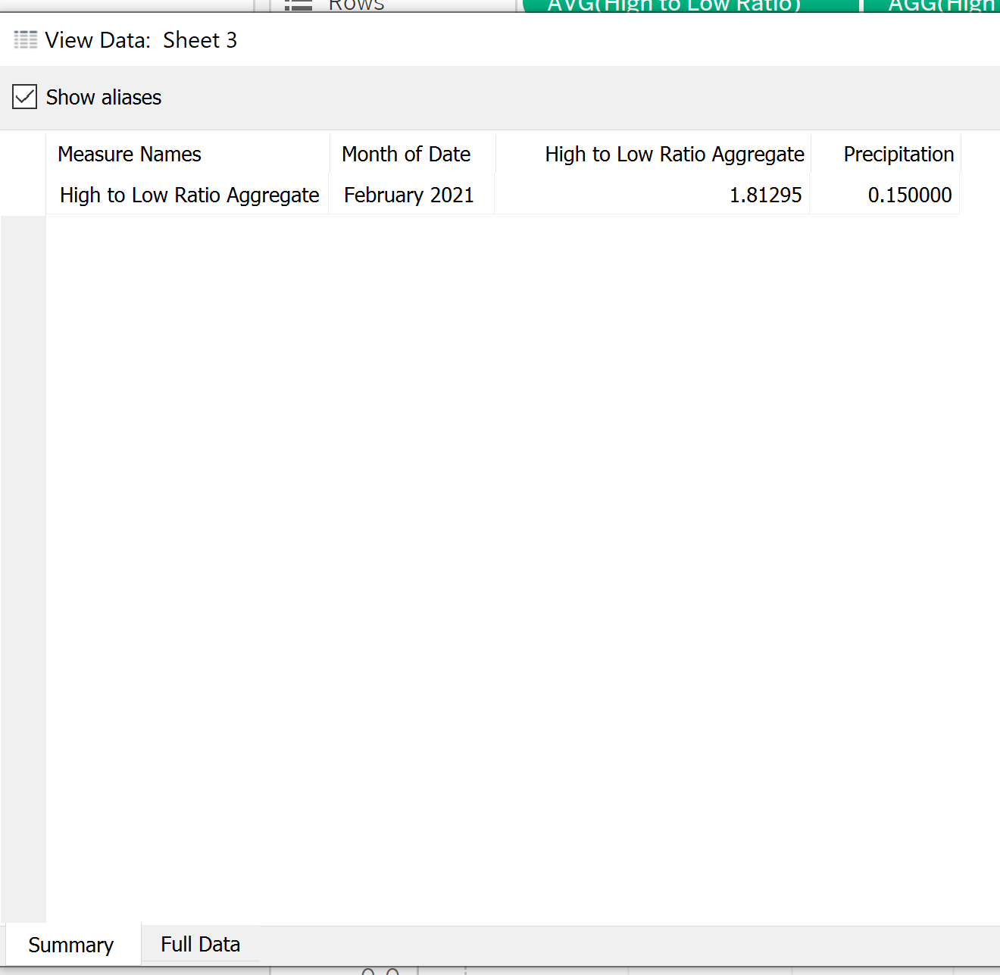
</figure>

<figure>
    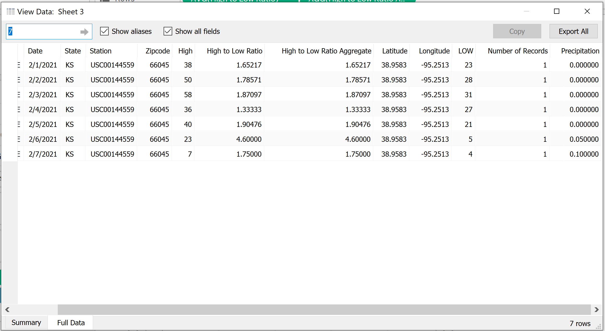
</figure>

From here you can use a calculator or other means to perform the calculation manually once to confirm the value you are receiving matches the expectation based on what your business is expecting. Because Tableau is great a providing visualizatoins based on whatever information it is given, it is always a best practice to double check what is recieved was expected.
