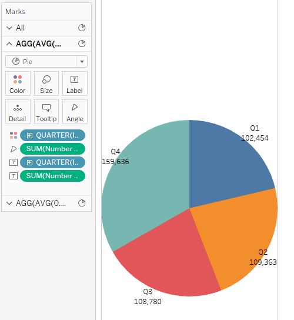
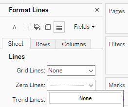
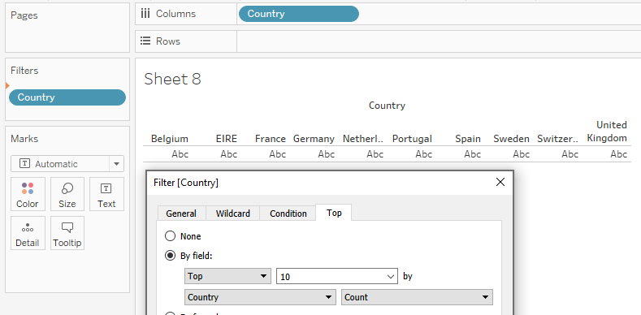
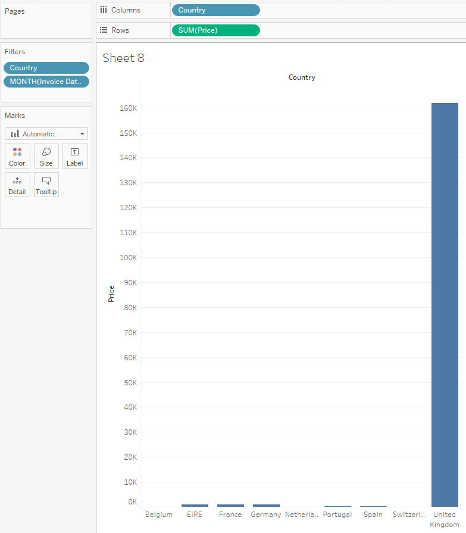
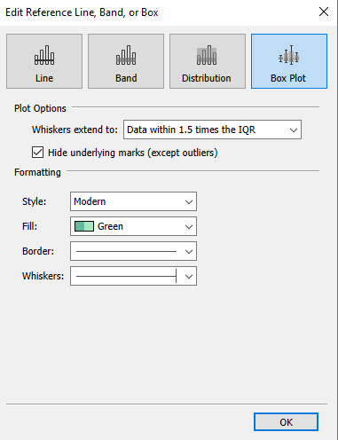

## Part 6 - Pie, Donut, and Box & Whisker Plots

This section focuses on the creation and customization of Pie, Donut, and Box & Whisker Plots. We'll also talk about legend formatting options. 

## Pie Charts

Data:
[online_retail_2010.csv](online_retail_2010.csv) 

The dataset we will be using for the following activities represents 480k real transactions from an online retail store in 2010 based out of the UK. 

Here we will walk through the steps to create and customize Pie Charts. These should only be used when trying to represent parts to a whole and should try to use 5 or less pieces. Additionally, before creating a Pie Chart one should consider if a Stacked Bar Chart could tell the same story. Now for the steps to create our pie charts.

Creating a heat map in Tableau is extremely easy and only requires a few steps. To start, in our marks card section we should change the dropdown from **Automatic** to **Pie**.

<figure>
    
</figure>

After setting the chart type to a pie we then need to consider what **Measure** we would like to use to represent the full amount of the pie. In this case we will use the **Number of Records** and drag this to the newly added **Angle** marks card. This will tell Tableau the size of each piece of the pie which currently is the full dataset and while it will be one full circle to start.

<figure>
    
</figure>

Next we need to think about what the dimensions we want to represent each piece of the pie and place the value on the **Color** marks card. For our dataset we will first create a pie chart representing the number of transactions in each quarter. Drag the **Invoice Date** field to the **Color** card and change the data element selection to **Quarter**.

<figure>
    
</figure>

The original Pie Chart created will be fairly small. To increase the size of the chart we will click on the **Size** marks card and drag the slider to the middle mark. This will make the Pie Chart as large as it can be inside of the row and colomn where it is projected. If you move the slider beyond the middle mark the edges of the pie will disappear outside the edge of the chart space. 

<figure>
    
</figure>

An additional benefit of setting the slider to the middle mark is that we can easily find the edges of the chart space now touching the pie so we can click and drag to resize the chart.

<figure>
    
</figure>

In this next step we will add a **Label** to identify which quarter each piece of the pie is associated with so that having a legend will not be necessary. Additionally, we'll see how we can place the labels on top of the pie. Hold down the *Control* or *Command* key and drag the **Quarter** dimension to the **Label** marks card. This will create a copy of the dimension makign it easier to reuse. We should now see **Q1 - Q4** added to our chart.

<figure>
    
</figure>

Placing the labels on top of the chart seems like an obvious and simple task but is anything but. For this step we actually need to move the labels one at a time manually. Well find taht if we click the labels we can drag them onto the pie and place them where we want.

<figure>
    
</figure>

Now we will want to style the labels so that they will be easier to read. We can do this by clicking the **Label** marks card and change the size and format of the text. Here we will set the size to 20pt and bold.

<figure>
    
</figure>

We now have a complete pie chart that can be used to compare the quarterly transactions. If we had multiple years of data or filtered on another dimension we could easily see how transactions have compared across quarters.

We'll now create our second Pie Chart, this time colored by **Country**. Let's drag the **Country** dimension to the **Color** marks card first this time. We'll notice that we get a wheel of 16 different colors. 

<figure>
    
</figure>

Next, we'll drag the **Sales** measure to the **Angle** marks card to size slices of the pie based on the **Sum of Sales**. This is a prime example of having too many slice in a pie that it becomes illegible. 

<figure>
    
</figure>

From here we should consider how we would like to limit the number of slices. The options could be to filter the dataset to only 5 countries or use a calcualted field to create an **Other** category to hold all the countires after the first 5. We will use the latter tactice and only show the **Top 5** countries by sales. To do this we will drag the **Country** pill to the **Filter** pane a make a few selections. 

The first thing we will do is deselect the **United Kingdom** becasue we can already tell that it will dominate any pie it's included in. For the second step click the **Top** tab and select the radio button for *By field*. In the boxes that illuminate we will set the values to **5** by **Sales Sum**.  

<figure>
    
</figure>

<figure>
    
</figure>

After completing the filter we can see that we now have a Pie with 5 slices representing the countries of **Eire, France, Germany, Netherlands, & Sweden**. We now have a pie chart that is easy to interpret and shows the total amount of the sales shared between these 5 countries.

<figure>
    
</figure>


## Donut Charts

Donut charts are very similar to pie charts, but they also make it easier to include information about the whole chart along with the slices. This is a much more complex task that requires creating two different pie charts and stacking them on top of each other. We will use the new second pie to create a white cirle to cover the center of the and give the impression of a donut. 

To start we will create the pie chart used previously for the quarterly count of records but without the manually placed labels. 

<figure>
    
</figure>

This next step will seem very odd. We will double click in the **Rows** section so that a white pill appears where we can type an equation. For the equation we will type ```AVG(0)``` and after clicking enter Tableau will translated this to **AGG(AVG(0))**. This places the center of the Pie chart on a *Y Axis* value of *0*. 

<figure>
    
</figure>

We will then perform the same step a second time creating two identical pills in the rows section. This will generate two pie charts in separate rows. 

<figure>
    
</figure>

Like previous activites, we will click the dropdown arrow to the right pill and select **Dual Axis** to place the pies on top of one another. Additionally, we will click the dropdown arrow and deselect **Show Header** and **Include in Tooltip** in both pills. 

<figure>
    
</figure>

<figure>
    
</figure>

Our next task will be to add the labels that will be used to to identify the quarter and number of records. In our marks card space where we now have tabs labeled **AGG(AVG(0))** we will select the first. Drag and drop the **Quarter** and **Number of Records** to the **Label** mark and leave these values in their default location. 

<figure>
    
</figure>

Now to finally make it look like a Donut, selece the second tab labeled **AGG(AVG(0))**. Remove the **Quarter** color pill and reduce the **Size** slider to the one quarter mark. 

<figure>
    
</figure>

By default the color will be grey. We can click the **Color** card and set the color to **White** to give the final illusion that the chart is a donut. We will also add the **Number of Records** measure to the **Label** marks card place the total value in the center of the donut. 

<figure>
    
</figure>

At this point I typically change the size of our white center to just below the middle mark to create a sliver for the donut leaving more room to increase the size of the certer label for readability.

<figure>
    
</figure>

The last step we may want to resize the row and column pane so that the outter labels fit nicely on the outside of the donut. At this same time we may notice there is a dotted line at the *Y Axis* value of *0*. To remove this we will right click on the chart and select **Format**. 

<figure>
    
</figure>

Within the **Format** pane on the lefthand side the screen the option we will want to change is in the **Lines** selection **Sheet** tab called **Zero Lines**. Change this value to **None** and the dotted line will disappear. 

<figure>
    
</figure>

<figure>
    
</figure>


## Box & Whisker Plot

Our final type of chart we will create is the Box & Whisker plot. This create is a greate way to represent multiple statistical measures and outliers by unique dimensions all at once. Again however, to accomplish the creation of a Box & Whisker plot requires some ingenuity. 

To begin we will want to determine for what dimension we want to create these plots. In this case we will create a plot for each country and limit our dataset to the top 10 by count.

<figure>
    
</figure>

Additionally, we'll filter the dataset down to only records in **December** by placing the **Invoice Date** pill in the **Filter Pane**. In the box that opens we'll select discrete **Months** so that we can individually select **December**. 

<figure>
    
</figure>

The next step is to determine which Measure we will use to create the Box & Whisker plots. In this case we'll use **Price** and place it in the **Rows** section so that a **Bar Chart** is initially created.

<figure>
    
</figure>

To generate our plots the data needs to be deaggregated and cannot be done by simply usings the **Detail** marks card this time. Instead we will deselect the feature in the **Analysis** menu called **Aggregate Measures**. 

<figure>
    
</figure>

This will create a Circle for each of the individual records shown in a column by country. 

<figure>
    
</figure>

From this step we can now use the **Show Me** tab to select the **Box & Whisker Plot** chart selection. 

<figure>
    
</figure>

This will officially generate our Box & Whisker plots, however, because of the extreme outliers for **United Kingdom** we don't easily see the plots. As done previously we'll right click on **United Kingdom** and select **Exclude**.

<figure>
    
</figure>

<figure>
    
</figure>

We now have Box & Whisker plots that we can read and interpret. We could stop and this point and effectively use these plots to analyze our data. 

<figure>
    
</figure>

Let's break down the datapoints visualized:

- The center between the grey boxes is the **Median** value
- The top and bottom of the box represent the **First Quartile** and **Third Quartile**
- The inner grey box represents the value called the **Inner Quartile Range**, also known as the **IQR**
- The whiskers that sometimes extend above and below the IQR represent the smaller or largest value between the **Median** and **+/-1.5 * IQR**
- Lastly any dots outside of the whiskers represent **Outliers** that were outside of the **Median** and **+/-1.5 * IQR**

To style and make the plots easier to read we will make edits to the chart. To do this right-click on one of the **IQR** boxes and select **Edit**. 

<figure>
    
</figure>

In the window that opens we can make multiple selections that will make our plots more aestheticly pleasing and easier to interpret. 

The first option will be to select the checkbox for **Hide underlying marks (except outlier)**. This will as it says remove all the dots except for outliers since there's no real need to see the dots represented by the Box & Whisker plot. Secondly we will change the **Fill** to be a color such as **Green**. 

Feel free to use this opportunity to test the other **Formatting** options to see how the slightly change the appearnce of the plots. 

<figure>
    
</figure>

We now have our complete Box & Whisker plots showing where we have outliers to consider and the dispersion of data by our dimension of countries.

<figure>
    
</figure>


## Formatting Legends

To demonstrate options we have to format our legends we will create a Map by **Country** colored by **Sales**. However to do this we will need to creat a calculated field called **Sales** where we multiply **Price** by **Quantity**. 

<figure>
    
</figure>

From here we can see our legend on the right side of the screen shows a continuous blue scale from **140** to roughly **7.5M**. Using the drop down option in the legend we can select **Edit Colors** to make changes to the way this legend works. 

<figure>
    
</figure>

The first thing we might be interested in is to change the colors to **Stepped** so that we have a distinct number of colros to compare on the map instead of a continuous specturm.

<figure>
    
</figure>

We can also change the beginning and end of the color pallege by selecting **Advanced** and checking the boxes for **Start** and **End**. Once checked we can enter values like **0** and **100,000** respectively so that we can see a true comparrision of our smaller values without having to exclude our largest of the **United Kingdom**. Instead the UK is just labeled the same darkness as **France** and **Germany** because the values are greater than **80,000**.

<figure>
    
</figure>

Lastly, we might want to format the values to be represented as currency. We can do this by selecting the **Format** option on the **Color** pill **SUM(SALES)**.

<figure>
    
</figure>

In the resulting pane on the lefthand side of the screen we will select the **Pane** tab and change the **Numbers** selectioni in the **Default** section to be **Currency(Custom)** with **0 decimals**.

<figure>
    
</figure>

This will result in our legend and all other values in the map to register as **American USD Currency** with a **$** in front of the values. If we need to change the Currency to something like the Brittish Pound we would instead have selected **Currency Standard** and picked the correct **Locale** of **English(United Kingdom)**.

<figure>
    
</figure>


<!-- ## Pie & Donut Activity

Data:
[bank-additional-full.csv](bank-additional-full.csv) 

The dataset we will be using for the following activities represent campaigns at a foreign bank to where phone calls were made to solicit -->